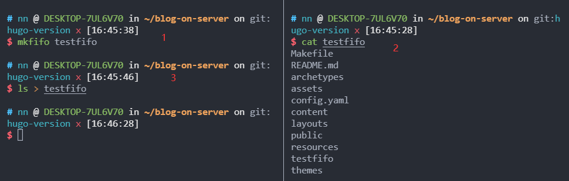
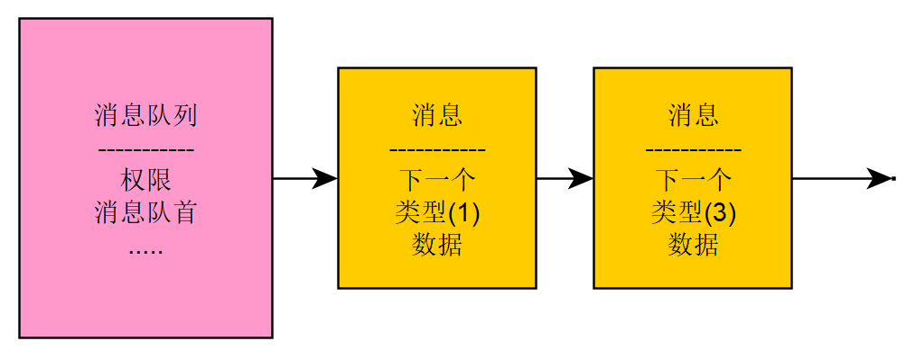
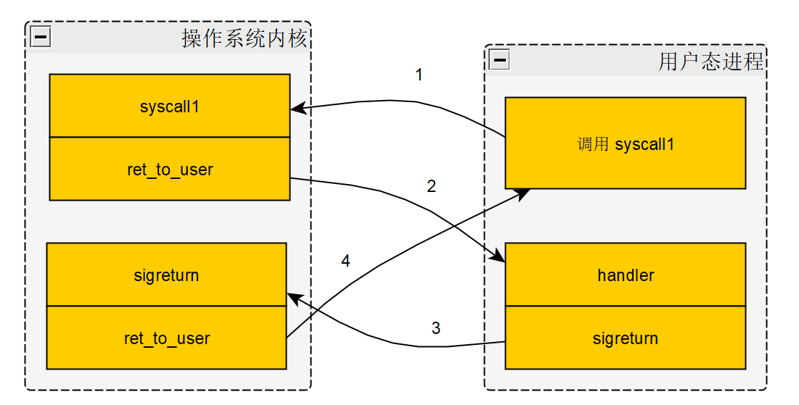

比赛终于告一段落，趁着这股劲顺便把操作系统里面不太熟悉的内容再学习学习。对于进程间通信这一块，之前我的了解仅限于在将近一年前的面试中被问到进程间通信有哪几种方式。然后我去搜了之后才知道原来除了**管道**、**信号量**之外还有**消息队列**、**共享内存**、**socket 通信**等。

---

正餐开始。

## 为什么有 IPC

说到为什么有 IPC，那就要提到为什么要多进程协作：

1. 功能模块化，避免重复造轮子。Android 提供一组进程用于绘制，其他应用只需要将需要绘制的画面信息传递给绘制进程即可，不需要操心绘制。
2. 增强模块间的隔离，提高安全性。
3. 提高应用容错能力（基于隔离性）。


## 基本概念

在设计 IPC 方案时，需要考虑**通信带宽**、**时延**、**数据段的长度**（太长导致内存浪费，太短导致频繁通信）、**消息检查方式**（轮询...）等种种问题。

消息传递是 IPC 中常用的数据传递方式，一般来说，消息的**基本接口**包括：

1. 发送消息：`Send(message)`
2. 接受消息：`Recv(message)`
3. 远程过程调用：`RPC(req_message, resp_message`
4. 回复消息：`Reply(resp_message)`

1 和 2 是一对，分别对应发送和接收，代表的是**单向通信**。而 3 和 4 是一对，在发送端发送 RPC 后，会阻塞自己，直到接收端回复了消息，因此代表的是**双向通信**。一般来说，很多系统选择的是单向和双向都可以的策略。很明显，管道、信号是单向的，而 socket、RPC 是双向的。

IPC 除了可以被分为**单向、双向、单双向**以外，还可以按照**同步、异步**进行分类。同步往往是双向 IPC (或者 RPC)，即发送者需要等待结果返回，才能进行下一步操作。当然也存在着一些单向的 IPC 是同步的，拿 golang 的无缓冲管道作为例子，假设有多个生产者以及一个消费者，当消费者在使用一个生产者的消息时，其他的生产者就会被阻塞，因此这种设计是同步的。而如果管道是有缓冲的，则这个设计就是异步的。

因为进程的隔离性，导致了双方很难确定对方的状态。比如 raft 算法中，master 会将用户发送的消息同步给 slave，当超过半数的 slave 确认已经提交消息时，master 才会确认提交这个消息。因此在这个过程中，master 需要等待 slave 返回消息。但是在等待的过程中，实在是无法确定 slave 不回消息是因为网络分区、网络延迟，还是因为故意不回。就像平时在生活中自己跟女朋友发信息，她不回，我们也无法确定她是故意不回还是因为手机没电了，或者是忘了回 doge.

因此，IPC 设计中就引入了**超时机制**。如果超过 5 秒没有反馈，则结束本次调用。这样可以避免类似于**拒绝服务**(denial-of-service)的攻击情况。但是这个超时时间到底取什么值也是个问题。同样拿女朋友这个例子，如果她 5 秒钟没有回复，你就重新发送消息，这将会消耗你大量的精力，并且让她觉得烦；如果她 1 个月没有回复消息，你才重新发送消息，那可能女朋友已经出人命了……虽然超时机制存在着问题，但是目前也没有很好的解决方案。

> #### 共享内存 和 基于共享内存的消息传递 
>
> 基于共享内存的消息传递以共享内存为媒介进行消息的传输，其核心的通信抽象仍然是**消息**。而共享内存的另一种使用方法是直接在多个进程之间建立共享区域，然后再共享区域上建立数据结构。进程可以**直接使用**该共享区域上的数据，而不存在”消息“的抽象。
>
> 但第二种方式存在着问题，比如共享内存的虚拟地址在不同进程的地址空间可能是不同的，这样导致指针相关的内容无法使用；同时还假设了共享内存的进程是互相信任的，这与多进程的隔离性优势存在冲突

### 通信连接管理-如何建立一个连接

不同的系统会有不同的实现，但是通常可以归为：**直接通信** 和 **间接通信**。

直接通信要求通信的一方需要显式地表示另一方。比如 TCP、UDP需要指定对方的 ip 地址和端口号才能进行传输。直接通信下的连接是自动的，在具体交互时通过标识的名称来完成。这意味着一个连接会唯一对应一对进程，而一对进程之间也只会存在一个连接。连接可以是单向也可以是双向的。

间接通信则需要经过一个中间的信箱来完成通信。每一个信箱有自己唯一的标识符，而进程间通过共享一个信箱来交换消息。一个具体的实现就是 golang 的 channel。

### 通信权限检查

IPC 通常是涉及多方的，一般是多个发送者、单个接收者。在这个过程中，通常会出现权限问题。比如一些私有的服务端进程是不希望任何的进程都能够连接到自己的服务的。

#### System V 进程间通信权限管理

System V 进程间通信通常指宏内核下三种具体的三种进程间通信机制：System V 消息队列、System V  信号量和 System V  共享内存。

System V 的权限管理基于文件的权限检查机制，而文件权限检查机制又依赖于进程的用户分类，以及基于文件的权限抽象来判定。比如文件的可读、可写、可执行；用户组、用户等概念。

#### 命名服务（naming server）

权限检查机制的引入保证了安全性，但另一个问题是如何分发权限呢？服务端进程可以将自己提供的服务告诉命名服务进程，客户端可以去命名服务上查询当前的服务，并选择自己希望建立连接的服务去尝试获取权限。从这个角度理解可以认为注册中心承担了命名服务的功能。

另一种权限发放的方式是继承。比如在 linux 中，匿名管道通常用于父子进程之间的通信，内核通常允许父进程将特定的权限继承给子进程。


## 宏内核进程间通信

包括【**管道**】，【System V中的**消息队列**、**信号量**、**共享内存**】，【**Linux 信号机制**】，【**套接字机制**】。

### 管道（pipe）

管道是单向的 IPC，内核中通常有缓冲区来缓冲消息，通信的数据是字节流，因此需要应用自己去解析数据。在“一切皆文件”的 Linux 中，内核会为用户态提供代表管道的文件描述符，让其可以通过文件系统相关的系统调用来使用。但这个操作并没有实际地创建文件，而是在内存中处理的，相当于只是用了文件系统的接口。

如果没有数据写入，接受者就开始读数据，则会有两种情况发生：

1. 看到 EOF
2. 阻塞在这个系统调用上，直到数据到来

第一种情况出现的原因是，当前系统里没有任何进程有这个管道的写端口，因为管道的两个端口在 UNIX 系列的内核中是以两个独立的文件描述符存在的，写端口可能被进程主动关闭了。针对第二种情况，进程可以配置非阻塞选项来避免阻塞。


#### 匿名管道 && 命名管道

这两者的区别在于不同的创建方式。匿名管道是通过 pipe 系统调用创建的，在创建时进程会同时拿到读写的端口（2个）。要怎么使用呢？通常是父进程 fork 出一个子进程，此时父子进程通过 fork 的继承完成了一次 IPC 权限的分发。此时就可以通信了，不过需要注意的是，双方需要主动关闭多余的端口。这种方式对于有创建关系的进程之间通信比较方便，但对于关系较远的进程就不太适用。

```c
#include <stdio.h>
#include <unistd.h>
#include <string.h>
#include <sys/wait.h>
int main()
{
    __pid_t pid;
    int fd[2];
    char str[20];
    pipe(fd);
    if ((pid = fork() == 0))
    {
        printf("children\n");
        close(fd[1]);
        int num;
        while ((num = read(fd[0], str, sizeof(str)) != 0))
        {
            printf("read: %s", str);
        }
    }
    else
    {
        printf("parent\n");
        close(fd[0]);
        for (int i = 0; i < 10; i++)
        {
            sprintf(str, "the %d message. \n", i);
            printf("write: %s", str);
            write(fd[1], str, sizeof(str));
        }
    }
}
```

命名管道解决了这个问题，其由 mkfifo 创建。在创建过程中会指定一个全局的文件名，通过这个文件名来指定一个具体的管道。



使用 `mkfifo` 创建管道后，在右边输入 `cat testfifo`将会被阻塞，此时在左边对管道进行输入，右边会得到输出。


### System V 消息队列

发送和接受的窗口是由内核提供的，支持同时存在多个发送者和接受者，并且为消息队列中每个消息提供了类型的抽象，使消息的发送者和接受者可以根据类型来选择性地处理消息。



上面的图片说明了消息队列的结构：

1. next 指针
2. 消息的类型
3. 消息的内容（字节流）

消息的类型可以是 int，也可以是 string，也可能是个结构体。

在 linux 中，消息队列有四个操作：

- `msgget`：获取已有消息队列的连接，或者创建一个新的消息队列
- `msgsnd`：往消息队列上发送消息
- `msgrcv`：从消息队列上接受消息
- `msgctl`：控制和管理一个消息队列

对于发送者来说，只要队列有空闲的空间就可以向其发送消息，而接收者只要有未读消息就可以直接读取消息并完成操作。如果发送时队列**没有可用空间**或**接收时没有未读消息**，则是阻塞。

在 Linux 中，一旦一个队列被创建，除非内核重新启动或该队列被主动删除，否则数据都是会被保留的。建议用共享内存的方式来传递长信息。消息在用户态和内核态之间传递时，会有拷贝的开销。


### System V 信号量

消息队列用于明确地传递消息，而信号量的主要作用是用于**同步**。信号两的主要操作是两个原语：P 和 V。

P 将计数器减一，V 将计数器加一。这一部分将在同步原语里细说。


### System V 共享内存

使用共享内存的很重要的原因是性能。像前面的消息队列、信号量、管道等虽然很方便，但是其中的数据拷贝、控制流转移等处理逻辑影响了性能。而共享内存不同，一旦共享区域完成建立，内核基本就不需要参与进程间通信。

共享内存的核心思路很简单，就是在一个或者多个即进程所在的虚拟地址空间里映射相同的物理内存页。共享内存可以实现理论。上的零内存拷贝的传输。如果是操作系统辅助传递方式，通常需要将数据先从发送者的用户态内存拷贝到内核内存，再从内核内存拷贝到接受者用户态内存。

在简单的共享内存 IPC 设计中，假设共享内存恰好可以存放两个消息，一个用于存放发送消息，另一个用于存放返回消息。通过设置消息头部的状态，可以标识此时这个消息是否准备就绪，从而进行通信。

### 信号进程间通信

管道、消息队列、共享内存主要关注数据传输设计上，而信号的一个特点是**单向的事件通知能力**。信号量也有通知的能力，但需要进程主动去查询，或陷入阻塞状态。而信号可以使进程随时发送一个事件到特定的进程、线程、进程组，并且接受时间的进程**不需要阻塞**等待该事件，内核会帮助其切换到对应的处理函数中响应信号事件，并且在处理完之后恢复到之前的上下文。比如父进程在执行结束之时，通知其所有的子进程应该杀死自己。

那么，这些对应的处理函数哪里来呢？一个进程会为一些特定的信号编号处理函数，就像前面的命名服务。通过`man 7 signal`命令可以查看 linux 中现有的标准信号。下面看一下如何为特定的信号注册一个用户态处理函数。

```c
#include<signal.h>
#include<stdio.h>
#include <unistd.h>

void handler(int signum)
{
    if(signum == SIGIO)
        printf("SIGIO   signal: %d\n", signum);
    else if(signum == SIGUSR1)
        printf("SIGUSR1   signal: %d\n", signum);
    else
        printf("error\n");
}

int main(void)
{
    //sighandler_t signal(int signum, sighandler_t handler);
    signal(SIGIO, handler);
    signal(SIGUSR1, handler);
    printf("%d  %d\n", SIGIO, SIGUSR1);
    for(;;)
    {
        sleep(10000);
    }
    return 0;
}

// 在 terminal 中输入 `kill -n pid` 即可向 pid 发送数字为 n 的信号
```

其中，handler 就是我们的处理函数。这个名字并不重要，重要的是函数的签名：`typedef void (*__sighandler_t) (int);`，必须是一个输入 int，返回 void 的函数指针。在 `signal.h` 头文件中定义了这样的一个函数指针。

```c
/* Type of a signal handler.  */
typedef void (*__sighandler_t) (int);
```

那么，内核到底是如何注册我们这个函数呢？内核为每个 task_struct 维护了一个信号处理的数组（sighand->action)，里面的每一项对应着一个信号的处理方式以及对应的处理函数。

```c
struct task_struct {
    ...
	struct sighand_struct __rcu		*sighand;
    ...
}

/*  /include/linux/sched/signal.h  */
struct sighand_struct {
	spinlock_t		siglock;
	refcount_t		count;
	wait_queue_head_t	signalfd_wqh;
	struct k_sigaction	action[_NSIG];
};

/* /include/linux/signal_types.h */
struct k_sigaction {
	struct sigaction sa;
#ifdef __ARCH_HAS_KA_RESTORER
	__sigrestore_t ka_restorer;
#endif
};


struct sigaction {
#ifndef __ARCH_HAS_IRIX_SIGACTION
	__sighandler_t	sa_handler;
	unsigned long	sa_flags;
#else
	unsigned int	sa_flags;
	__sighandler_t	sa_handler;
#endif
#ifdef __ARCH_HAS_SA_RESTORER
	__sigrestore_t sa_restorer;
#endif
	sigset_t	sa_mask;	/* mask last for extensibility */
};

/* /include/uapi/asm-generic/signal-defs.h */
typedef void __signalfn_t(int);  // 定义函数类型
typedef __signalfn_t __user *__sighandler_t;  // 定义函数指针类型
```

上面的代码从 task_struct 开始一直追踪溯源，终于回到了熟悉的`*__sighandler_t`，注册操作便是把用户自定义的函数赋值到`task_struct`的一个成员下。

显然，用户注册的信号处理函数是用户态的代码，当内核在处理对应的信号时，需要返回到用户态去执行处理函数。在 linux 中，信号得到处理的时机通常是内核**处理完异常、中断、系统调用**等返回到用户态的时刻。内核出出力信号的方式有下面三种：

- 忽略
- 调用用户注册的信号处理函数
- 调用默认的信号处理函数（一般是直接杀死进程或者忽略信号）



上图展示过程是：用户态进程调用系统调用后进入内核。内核处理完后发现有信号需要处理，于是又切换到用户态处理函数的位置。处理完后又通过 sigreturn 函数回到内核。最后完成系统调用，又回到用户态进程。（sigreturn 函数的作用就是辅助内核恢复到被信号打断之前的上下文）

信号处理函数需要是**可重入的**。意思就是，可以重复调用。因为信号可能会被嵌套，在处理一个信号的时候，又遇到了一个信号，则当前进程可能会暂停当前的信号处理函数，并且重新切换到开头去处理新的事件。这需要以下几点来保证函数的可重入性：

1. 不使用静态数据，或者静态数据都是只读的
2. 尽量只使用本地数据
3. 在必须使用全局共享变量的情况下，需要保护对全局数据的访问，且避免死锁
4. 避免在函数中修改自己的代码
5. 不调用不可重入的函数，如 malloc

### 套接字进程间通信

在 6.824 实验的 lab1 中，进程间通信使用的就是 UNIX domain socket，其使用了本地文件系统中的一个路径作为地址。与计算机网络比较相关，细节不再描述。


## 微内核进程间通信

> TODO


## 参考资料

1. [《现代操作系统原理与实现》](https://book.douban.com/subject/35208251/)
2. [linux 信号](https://www.jianshu.com/p/f445bfeea40a)
