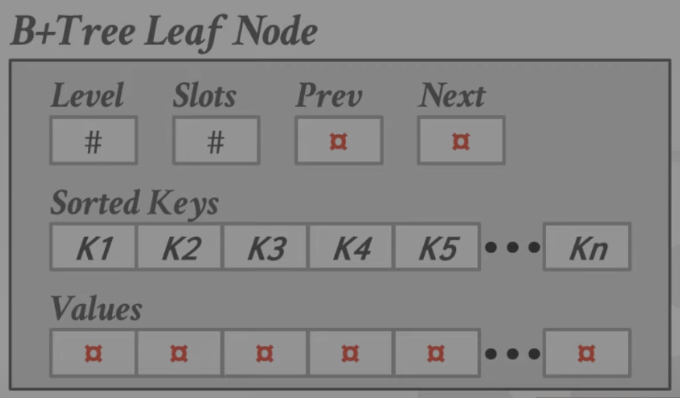

B+树是 M 路搜索树，有着以下几个特点：

- 非常平衡，每个叶子结点的深度是相同的
- 除了根节点之外的所有节点，其包含的 key 一定是超过半饱和的，即`M/2-1 <= #keys <= M-1`
- 每个内部节点（非叶子结点），如果有 k 个 key 的，则它一定有 k+1 个非空子节点。

> ### 内部节点
> 内部节点有 k 个 Key，相当于一条直线被 k 个点分割，可以被分割成 k+1 个区间。
> 这意味着内部节点还存有 k+1 个对应区间指针（指向内部节点||叶子结点||为空）

> ### 所有节点
> 每个 B+树的节点都存储着一组键值对。对于叶子结点来说，其存放的可以是真正的数据，或者是指向数据的指针。对于非叶子结点来说，其存放的可以是指向其他节点的指针，或者为空。
>
> 通常来说，这组键值对都是按照 key 排序过的，以便于查找操作。



实际上叶子结点的数据是如上图存放的，Level 和 Slots 保存了这个节点所在的层数和槽目，同时还保存了指向自己兄弟节点的指针。存放着有序排列的 key，同时 value 也是按照同一个顺序排列的。

> ### 为什么不把 key 和 value 放到一起？
> 因为 key 和 value 的大小往往是不同的，不定长会导致在查找某个 kv 的时候不能使用二分查找。同时，在查找时不需要知道 value 的数据，这也能够提高缓存的命中率。知道了 key 的 index 之后再去 value 数组里定位数据。

## B+树和 B 树的区别

主要区别在于 B+树只有在叶子结点存放了数据，而 B 树在所有节点都存有数据。

由于 B+树存放数据又是有序的，因此其好处就是在范围查找，比如`select * from tb where name = "user"`这种查找时，速度会比 B 树快。（磁盘的特性）

另一方面，因为 B 树每个节点都存放着数据，所以它不存在重复的 key，而 B+树因为上层索引的存在，可能存在一些重复的 key。


有重复的 key 会导致不一致的现象，比如删除了叶子结点，可能并不会删除内部节点中相同 key 的节点，直到 B+树重新进行平衡后才会处理内部节点。

## B+树的插入

找到一个正确的叶子结点 L，将数据保持有序地插入到 L 中。

1. 如果 L 有足够的空间，则成功
2. 否则触发分裂。将 L 的 key 分裂为 L 和一个新的节点 L2
   1. 将所有 key 平均地划分到两个节点里，并将位于中间的 key 拷贝。
   2. 将作为 index 且指向 L2 的指针插入到 L 的父节点中。

整个步骤就是这样，将条目平均分配，然后将中间的 key 往上推动。

[Demo](https://www.cs.usfca.edu/~galles/visualization/BPlusTree.html)

度为 4，节点最多有 3 个，最少有 2 个 key（4/2）。


插入 23，发现有 4 个 key，则触发分裂。


将 14，15 分为一组，22，23 分为一组，同时将 22 作为新的索引，添加到父节点


此时发现父节点满了，则又触发分裂，将 22，24 分为一组，34，42 分为一组，将 34 作为索引节点，即最新的根节点。


## B+树的删除

从根节点开始，找到叶子结点 L 中要删除的条目，删除它。

1. 如果 L 仍然是有半数及以上的 key，就结束流程
2. 如果只有`M/2-1`个，则
   1. 尝试从兄弟那里借几个 key 来，使两兄弟都是半数及以上的 key
   2. 如果借失败了，说明两兄弟合起来都没有 M 个，则将两个兄弟合并。

如果出现了合并操作，则必须删除内部节点中有指向这两个

此时删除 42


再删除 43，发现这个节点 key 太少了，就向兄弟节点偷一个 key


此时删除 34


发现 key 太少了，就从兄弟借。但是兄弟也只剩一个了，就只能合并了。


合并完之后，向兄弟偷一个，就平衡了


偷完之后如下图


> ### B+树的合并往往会被延迟
>
> 一些数据库在节点只有一半满的时候就合并，而是推迟节点的合并操作，这样可以尽可能地减少树结构的变化。更好的情况可能是尽量让节点下沉出现（合并之后数量都不够），然后定期重建 B+树。

## Key 的存储

有的时候 key 是变长的，针对这类的 key，有以下几种方法：

- 存储指针，指针指向真正的 key 存储的位置。
- 使用变长的节点，即 B+树的节点的大小可变，这需要非常小心地管理内存
- 把 key 填充到某个大小，比如要存储邮箱，定义邮箱的最大长度是 40 字节，就把所有的 key 都填充为 40。这相较于原来的 1024 字节一个 key 来说节省了不少的空间。
- 存所有 kv 的指针数组（数组有序），指针数组里的指针指向的 kv 数据还是在同一个页面当中。指针数组从前往后增长，kv 从后往前增长。kv 不需要保持有序，只需要改变指针数组里存放的指针即可实现有序。-这种方法更常见


## Key 不是唯一的怎么办？

前面提到的 key 假设全都是唯一的，现在如果有重复的 key 的话要怎么处理？

### 对于叶子结点来说

- 使用相同的叶子节点布局，但是多次存储重复的 key-这种方法更常见

  

- 只存一个重复的 key，然后维护一个 value 的链表

  

### 对于整颗树来说

- 增加记录的 id
  - 给元组加一个独一无二的 id 来作为 key 的一部分，因此可以使得所有的 key 是唯一的
  - DBMS 仍然可以用 key 的某一部分来寻找对应的 kv

- 增加溢出页，但是这里是无序的，因此只能使用线性搜索了，如下图所示

  

## 叶子结点怎么查找 key

- 线性查找，从头到尾扫描 key
- 二分查找，key 保持有序后，可以使用二分查找
- 估计法，基于已经知道的分布情况大概估计想找的 key 的位置。

## 优化方案

### 前缀压缩法


三个 key 的前缀都包含 rob，因此只需要存储不一样的部分即可。

### 后缀截断法


只需要存储能够辨别两个 key 的最小前缀即可（即后缀被删除）


### 批量插入（bulk insert）

假设要插入： 3，7，9，13，6，1

要做的是提前将他们排序好，然后自下而上地构建索引，而不是插入到已经有的数据里，自上而下地去构建。这样的做法会快很多。


### pointer swizzing


将原来存放的 page id，改为存放页面的指针


这样就不需要每次都要去 buffer pool 里取了，这个代价非常大，因为涉及到锁的争用。这些页面也是能够保证不会被 victim 的，因此不会访问到非法的地址。

### 隐含索引 (implicit index)

大部分数据库管理系统都会自动为一些完整约束创建索引，比如 primary 主键、unique 约束。如果我们将某一列设为主键，则 DBMS 会为这一列创建一个索引。但是不会对外键去创建一个索引。

### 部分索引（partial index）

很多时候并不需要整张表的索引，而只是需要部分数据的索引

```sql
CREATE INDEX idx_foo ON foo (a,b) WHERE c = 'WUTANG'

SELECT b FROM foo WHERE a=123 AND c = 'WUTANG'
```

在创建索引时添加一个 WHERE 条件，这样就创建了一个部分索引。这个索引只在 c = 'WUTANG'条件成立时生效。这个操作类似于给每个月份都创建索引，我们在搜索某个月的数据时，只需要那一个月的索引即可。

### 覆盖索引（covering index）

索引内容覆盖了要查询的内容，就不需要再去表文件里查数据，该索引叫做覆盖索引。

```sql
CREATE INDEX idx_foo ON foo (a,b) // 以列 a,b 创建索引
SELECT b FROM foo WHERE a = 123; 
```

在表 foo 中创建基于列 a,b 的索引后，第二句的查询内容完全被索引覆盖，该索引被称为覆盖索引。原因是：如果是普通索引，索引的叶子结点里存放的是行数据的 id，DBMS 需要回表查询数据，即需要扫描两遍索引。

#### 普通索引查询过程

假设有表 foo`(id PK, name KEY, sex, flag);` id 是聚集索引，name 是普通索引。

表中有四条记录：

```
1, shenjian, m, A
3, zhangsan, m, A
5, lisi, m, A
9, wangwu, f, B
```


image 两个 B+树索引分别如上图：

（1）id 为 PK，聚集索引，叶子节点存储行记录；

（2）name 为 KEY，普通索引，叶子节点存储 PK 值，即 id；

通常情况下，需要扫码两遍索引树。

例如：

`select sex from foo where name='lisi';`

**是如何执行的呢？**


如**粉红色**路径，需要扫码两遍索引树：

（1）先通过普通索引定位到主键值 id=5；

（2）在通过聚集索引定位到行记录；

这就是所谓的**回表查询**，先定位主键值，再定位行记录，它的性能较扫一遍索引树更低。

如果普通索引升级为覆盖索引（如创建 name 和 sex 的联合索引），就不需要重新去聚簇索引扫描了。

### 覆盖索引无法覆盖查询字段？使用 INDEX INCLUDE COLUMNS

```sql
CREATE INDEX idx_foo ON foo (a,b) INCLUDE (c)
```

使用 INCLUDE 关键字，可以将 INCLUDE 包含的列数据保存在叶子结点里，即 B+树的内部索引节点是不包含 c 的数据的，在节点里是包含 c 数据的，因此使用该方法也可以保证 DBMS 不会有回表操作。

```sql
SELECT b FROM foo WHERE a = 123 AND c = 'WuTang';
```

这条语句就可以先去 (a,b) 的索引里先查找符合 a=123 的条目，然后在找到的叶子结点中找到符合 c='WuTang'的条目。

### FUNCTIONAL/EXPRESSION INDEXES

有的时候索引并不需要以数据表**原来的数据**来创建索引，而是使用原始数据派生出来的数据来作为索引。

例如有这样一条查询语句

```sql
SELECT * FROM users WHERE EXTRACT (dow FROM login) = 2
```

dow 的意思是 day of week，Sunday 对应 0，Monday 对应 1，Tuesday 对应 2。该语句的意思就是查找在星期二登录的用户。

如果使用下面的索引，是无效的。

```sql
CREATE INDEX idx_user_login ON users (login);
```

而应该使用下面的索引，为派生出来的数据创建索引。

```sql
CREATE INDEX idx_user_login ON users (EXTRACT (dow FROM login))
```

部分索引也可以起到加速（优化）的作用，在星期二的基础上创建索引即可。

```sql
CREATE INDEX idx_user_login ON foo (login) WHERE EXTRACT (dow FROM login) = 2;
```

## TIRE TREE

前缀树

## RADIX TREE

基数树

## INVERTED INDEX

倒排索引