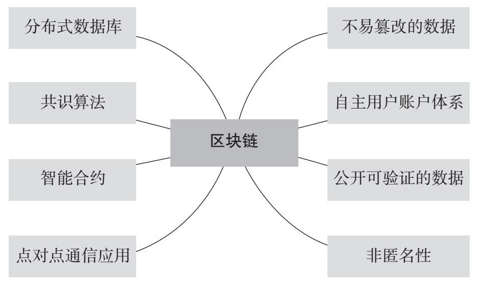

## 区块链的起源

### 账本演变

从账本演变的角度来看，区块链是一个分布式共享的账本系统。这个账本有以下三个特点：
1. 可以无限增加的巨型账本——每个区块可以视作这个账本的一页，每增加一个区块，账本就多了一页，这一页中可能会包含一条或多条记录信息；
2. 加密且有顺序的账本——账目信息会被打包成一个区块并加密，同时盖上时间戳，一个个区块按时间戳顺序链接形成一个总账本；
3. 去中心化的账本——由网内用户共同维护的，它是去中心化的。

### 价值转移

互联网很善于处理信息分享，却不能解决价值转移这件事。比如上传视频到某个网站可以让大家都看到这个视频，但是价值转移必须需要中心化的第三方来背书。第三方必然有人的参与，往往意味着不可信。

区块链技术就这样应运而生了，它可以在没有第三方信用背书的情况下，在一个开放式的平台上进行远距离的安全支付。区块链跨越多个遍布全球各地的节点，保存所有交易的历史记录。

而且，网络中所有授权的参与者都保存着一份完全相同的账本，一旦对账本进行修改，全部副本数据也将在几分钟甚至几秒钟内全部修改完毕。分布式账本中的每一笔交易都有一个独一无二的时间戳，这样可以防止重复支付的产生。

### 信用成本

你凭什么相信一个陌生人？别人凭什么相信你？区块链用算法证明机制来保证这份信任。借助它，整个系统中的所有节点能够在信任的环境下自动安全地交换数据。与费时费钱的其他工具技术相比，它能实时自动撮合、强制执行，而且成本很低。与其相信人，不如相信技术。区块链技术带来的是一种智能化信任。

公信力意指在社会生活中，公共权力面对时间差序、公众交往以及利益交换时，所表现出的一种公平、公正、公开、人道、民主与责任的信任力。当前社会，公信力一般由政府、国家机关或政府授权的第三方组织来提供。

区块链公信力有什么特点呢？
1. 区块链是分布式的，区块链公信力在网络上会有许多独立的节点，每一节点都有一份备份信息。每个有授权的人都可以从任意一个节点下载全部的信息，同时，区块链公信力网络也是不可篡改的，任何节点企图更改信息都会被其他节点发现，而更改的节点不会被确认，就会立刻丧失公信力。
2. 在区块链公信力模型中，区块链不制定政策，它只是一个公证人的角色，是政府建立和执行政策的工具。区块链的作用是帮助政府更快速和准确地让政策被全民所接受与认可，同时，因为区块链是一个不变的、可以被复制的数据库，政府的政策就变得公开和透明。

从信任的角度来看，区块链实际上是用基于共识的数学方法，在机器之间建立信任并完成信用创造。基于这样的特点，其对公信力的提升也有着开创性的意义。《经济学人》杂志这样写道：区块链是一台创造信任的机器，可以说区块链最核心的问题就是解决信用共识的问题。

### 技术创新

《比特币：一种点对点的电子现金系统》论文中提出了比特币的几个基本原则：

1. 一个纯粹的点对点电子现金系统，使在线支付能够直接由一方发起并支付给另一人，中间不需要通过任何金融机构。
2. 不需要授信的第三方支持就能防止双重支付，点对点的网络环境是解决双重支付的一种方案。
3. 对全部交易加上时间戳，并将他们并入一个不断延展的基于哈希算法的工作量证明的链条作为交易记录。除非重新完成全部的工作量证明，形成的交易记录将不可更改。
4. 最长的链条不仅将作为被观察的事件序列的证明，而且被视为来自 CPU（中央处理器）的计算能力最大的池。只要大多数 CPU 的计算能力不被合作攻击的节点所控制，那么就会生成最长的、长度超过攻击者的链条。
5. 这个系统本身需要的基础设施非常少，节点尽最大努力在全网传播信息即可，节点可以随时离开和重新加入网络，并将最长的工作量证明作为该节点离线期间发生的交易的证明。

看完上述的观点和逻辑，你是不是已经相信这样的理论是可行的，无须中心化的干预或者参与，只要让网络扮演信用中介的角色，就能实现有效的点对点交易。

## 区块链原理

区块链本质上是一个去中心化的分布式账本，其本身是一系列使用密码学而产生的互相关联的数据块，每一个数据块中包含了多条经比特币的网络交易有效确认的信息。

### 区块

区块作为区块链的基本结构单元，由包含元数据的区块头和包含交易数据的区块主体构成。
区块头包含三组元数据：
1. 用于连接前面的区块、索引自父区块哈希值的数据；
2. 挖矿难度、Nonce（随机数，用于工作量证明算法的计数器）、时间戳；
3. 能够总结并快速归纳校验区块中所有交易数据的 Merkle（默克尔）树根数据。

区块链系统大约每 10 分钟会创建一个区块，其中包含了这段时间里全网范围内发生的所有交易。每个区块中也包含了前一个区块的 ID（识别码），这使得每个区块都能找到其前一个节点，这样一直倒推就形成了一条完整的交易链条。从诞生之初到运行至今，全网随之形成了一条唯一的主区块链。

### 哈希算法

哈希算法是区块链中保证交易信息不被篡改的单向密码机制。哈希算法接收一段明文后，以一种不可逆的方式将其转化为一段长度较短、位数固定的散列数据。
它有两个特点：
1. 加密过程不可逆，意味着我们无法通过输出的散列数据倒推原本的明文是什么；
2. 输入的明文与输出的散列数据一一对应，任何一个输入信息的变化，都必将导致最终输出的散列数据的变化。

在区块链中，通常使用 SHA–256（安全散列算法）进行区块加密，这种算法的输入长度为 256 位，输出的是一串长度为 32 字节的随机散列数据。

区块链通过哈希算法对一个交易区块中的交易信息进行加密，并把信息压缩成由一串数字和字母组成的散列字符串。区块链的哈希值能够唯一而准确地标识一个区块，区块链中任意节点通过简单的哈希计算都可以获得这个区块的哈希值，计算出的哈希值没有变化也就意味着区块中的信息没有被篡改。

### 公钥和私钥

在区块链的话题中，我们还经常听到这样的词汇——公钥和私钥。这就是俗称的不对称加密方式，是对以前的对称加密方式（使用用户名与密码）的提高。

我们用电子邮件加密的模型来简单介绍一下：公钥就是给大家用的，你可以通过电子邮件发布，可以通过网站让别人下载，公钥其实是用来加密 / 验章的。私钥就是自己的，必须非常小心保存，最好加上密码，私钥用来解密 / 签章，私钥由个人拥有。

在比特币的系统中，私钥本质上是 32 个字节组成的数组，公钥和地址的生成都依赖私钥，有了私钥就能生成公钥和地址，就能够花费对应地址上面的比特币。私钥花费比特币的方式就是对这个私钥所对应的未花费的交易进行签名。

在区块链中，使用公钥和私钥来标识身份，我们假设区块链中有两个人，分别为小白和小黑，小白想向小黑证明自己是真实的小白，那么小白只需要使用私钥对文件进行签名并发送给小黑，小黑使用小白的公钥对文件进行签名验证，如果验证成功，那么就证明这个文件一定是小白用私钥加密过的。由于小白的私钥只有小白才能持有，那么，就可以验证小白确实是小白。

在区块链系统中，公钥和私钥还可以保证分布式网络点对点信息传递的安全。在区块链信息传递中，信息传递双方的公钥和私钥的加密与解密往往是不成对出现的。

信息发送者：用私钥对信息进行签名，使用信息接收方的公钥对信息加密。

信息接收方：用信息发送者的公钥验证信息发送者的身份，使用私钥对加密信息解密。

### 时间戳

区块链中的时间戳从区块生成的一刻起就存在于区块之中，它对应的是每一次交易记录的认证，证明交易记录的真实性。

时间戳是直接写在区块链中的，而区块链中已经生成的区块不可篡改，因为一旦篡改，生成的哈希值就会变化，从而变成一个无效的数据。每一个时间戳会将前一个时间戳也纳入其随机哈希值中，这一过程不断重复，依次相连，最后会生成一个完整的链条。

### Merkle 树结构

区块链利用 Merkle 树的数据结构存放所有叶子节点的值，并以此为基础生成一个统一的哈希值。Merkle 树的叶子节点存储的是数据信息的哈希值，非叶子的节点存储的是对其下面所有叶子节点的组合进行哈希计算后得出的哈希值。

同样地，区块中任意一个数据的变更都会导致 Merkle 树结构发生变化，在交易信息验证比对的过程中，Merkle 树结构能够大大减少数据的计算量，毕竟，我们只需验证 Merkle 树结构生成的统一哈希值就可以了。

## 区块链技术特性

### 分布式数据库

区块链的核心就是数据库，而且大部分区块链技术在底层实现上采用了传统的数据库引擎来保存数据。区块链网络各个节点是复制同步的分布式数据库。每个 “健康” 节点上的数据库里都有着完整的区块链上的所有数据和历史信息。由于每个节点上都有完整的检索数据， 因此在每一个节点就能直接查询到区块链上的任何记录，不需要依赖任何第三方。

### 共识机制：让各个节点的数据库保持一致的方法

之前我们提到，区块链就是一种分布式数据库，是有很多个节点的复制的数据库，而且每个节点都可以独立验证数据，不需要依赖第三方。那么，一个很自然的问题就是：如何能让这些节点的数据库保持一致？传统的分布式数据库设计有一个重要的假设，即分布式数据库的每个节点都是 “友好” 的。因此，要保持数据一致，主要需要克服的是一些技术问题，比如网络延迟怎么办？网络临时中断怎么办？不同节点上的用户对相同的数据都想进行修改怎么办？…… 所有这些问题在区块链这种分布式数据库上全部存在。除此之外，区块链的一个重要想法是，不能默认各个节点都是 “友好” 的，有可能有些节点就是有意要“制造麻烦”，这就使得区块链要解决这个问题更为困难

**“共识机制”的根本目的在于 确保区块链各节点上的数据是一致的。**因此，达成共识注定是一个 “慢” 且“费劲”的过程，但这就是代价——为了实现区块链系统的分布式、去中心化、独立验证、数据难被篡改等特性所必须付出的代价。可以肯定的是，区块链系统的性能必然会始终低于集中式系统。对这一事实的理解和把握，是我们决定一个应用是否应该采用区块链技术，或者决定一个应用的哪些部分应该采用区块链技术的重要原则，即**高性能永远不是采用区块链技术的首要目标。**

**共识算法对公链（公共区块链，或无须许可的区块链）至关重要**，因为任何人不需要任何许可就能加入这类区块链网络，因此无法确认节点的意图，即便发现其可能有恶意也难以杜绝，这就导致共识算法几乎是保证这类区块链系统可靠的唯一途径。而需要许可的区块链，例如联盟链，其成员往往被一定规则约束，从身份识别验证、加入网络、访问权限到参与活动都是受控制的。在这类区块链架构中，除共识算法之外还有很多方法可以保证系统安全和数据一致性，因此可以选择更轻量 的 共 识 机 制 ， 例 如 实 用 拜 占 庭 容 错 算 法 （ PracticalByzantine Fault Tolerance，缩写为 PBFT），而在联盟链环境下选择工作量证明机制往往是不必要的。

> 拜占庭容错是由莱斯利 · 兰波特于 1982 年在其同名论文中提出的分布式点对点网络通信容错问题。其含义是，在存在消息丢失的不可靠信道上试图通过消息传递的方式达到一致性是不可能的。因此，对一致性的研究一般假设信道是可靠的，或不存在本问题。这个难题也被称为 “拜占庭将军问题” 或者“两军问题”。

### P2P 通信

为了成为一个有 “共识” 的、可靠的分布式数据库，而且能够不依赖任何中间人，区块链必须在网络传输上有所突破，解决这个问题的方法就是 P2P（点对点）通信。

区块链每个节点都独立地和其他节点进行通信，每个节点都会采用 “存储—转发” 策略来 “收听” 其他节点发送的内容，并且广播自己产生的信息或者转发收到的信息。这种通信方式可以避免区块链网络依赖一些关键的中间节点，也可以防止少数节点被恶意操纵后对整个区块链网络产生影响。由于采用了 P2P 通信方式，区块链的 “去中心化” 特性比常见的互联网应用（如万维网服务）更强。

### 公开可验证的数据

区块链的节点都是可见的。对于比特币、以太坊这种典型的公链而言，链上的任何数据都是完全公开的，也就是一旦数据上链，那么全世界任何人都可以看到，而且区块链上的数据是难以删除或修改的，因此一旦数据在区块链之上发布就成为公开的信息。

区块链上的数据普遍使用了一些常用的加密和签名算法来保证数据的确性和一致性，因此在每个区块链节点上都可以立即验证链上数据的正确性。事实上，这些节点在维护其数据时，总是通过这些算法随时独立地校验数据，不会盲从任何第三方。

区块链如何进行数据的验证呢？这涉及两个重要的计算机密码学相关的技术：一是哈希算法，二是数字签名技术。

在区块链里保存数据的时候，哈希算法被用在很多地方。例如，在每一 “块” 数据里都保留有这一块数据经过哈希计算的结果，因此只要把块内的数据按照相同的哈希算法计算一遍，再比较一下结果是否一致，就能知道这块数据是否正确。而区块链里每一块的数据还包含着前一块的哈希计算结果，并且把前一块的哈希计算结果用于自己这一块来计算哈希结果。这样一来，任何一点数据的变化都会牵一发而动全身。

区块链上保存的来自用户的数据都包含该用户的数字签名，数字签名的特点是可以迅速验证签名的正确性，而且篡改数据、伪造签名几乎都是不可能的。每个区块链的节点软件都会独立验证每条数据的签名是否吻合。

正因为区块链具有这种数据公开可验证的特点，把需要确保数据真实性、难以篡改、可以验证的信息用区块链实现是合乎情理的，这就是人们常说的 “数据上链”。但数据上链通常并不是把数据本身放入区块链，而是把数据真实性和一致性的证明信息（例如数据的哈希验证码）或加密后的数据放在区块链上。

### 难以篡改的数据记录

区块链上的记录并非不可篡改，而只是 “难以篡改”。要想“篡改” 数据，首先得骗过每个节点的验证算法，这已经非常困难了，其次还得骗过整个区块链的共识机制，让所有的节都跟着改变，这更是难上加难。

区块链是个 “不支持删除操作” 的数据库，区块链的数据只会不断增加，不会被删除。由于这些特点，区块链比较适用于非常重要、需要留下 “审计记录” 的场合。例如，对关键敏感信息的访问记录或对保密资料的任何访问意图和使用记录，如果采用区块链技术来进行，就能有效对访问行为进行审计分析（因为一旦这些记录被记入区块链就难以被修改或删除）。

区块链的数据虽然难以被篡改，但并不意味着 “不可篡改” 或“数据永不丢失”。一般而言，区块链的节点越多、越分散，数据被篡改或完全被破坏的难度就越大，这是比较容易理解的。这也是大家提到区块链就会想起 “去中心化” 的一个重要原因，在一个去中心化程度非常高的区块链上，要篡改或破坏数据是极其困难的。但是，如果区块链的网络节点非常少（比如一个测试性的区块链可能只在一个节点运行），或者如果全部或大部分节点控制在少数人手里，那么篡改或完全破坏数据是能够做到的。

### 智能合约：链上的 “代码逻辑”

—以太坊的智能合约既不具备我们常说的 “智能”（人工智能、自动化逻辑等），也不太符合大众理解的 “合约”（合同、法律条款），而只是一种新的结合了区块链的计算模型，配合了一个图灵完备的虚拟机和一种新的程序设计语言。

把 “程序逻辑” 放在区块链上，就使得这些代码逻辑如同链上数据一般公开可验证。也许有人问，如果代码开源不是也可以做到公开吗？是的，开源的代码是公开的，但并不能做到可验证。虽然你能看到项目的源代码，但不能保证真正执行的就是源代码对应的程序。以太坊的设计中实现了一个以太坊虚拟机 (Ethereum Virtual Machine，缩写为 EVM），这些虚拟机包含在所有的以太坊节点软件里作为其一部分。智能合约需要执行的时候，相当于每个以太坊的节点都独立地执行这些代码。

以太坊智能合约的设计、实现和采用链节点内置专用虚拟机的执行模型只是代表智能合约的一种实现方法，并不是所有区块链都应该采用相同的实现方法。

### 自主账户体系

所谓自主账户，是指账户不是由其他人分配的，而是用户自我产生、自我申明的。自主账户体系能够实现，得益于现代计算机密码学，用户只需要按照一个算法执行一下，就可以获得自己独特的、安全的账户。自主账户体系的进一步发展和延伸，也许是区块链应用除了数字货币以外的又一个重要领域——去中心化身份。

### 区块链并不是真正匿名的

由于区块链数据的公开性，采用大数据分析的方法可以很容易发现各个账户之间的关系，账户的一举一动都完全暴露在各种分析决策工具之下，由于区块链的历史数据也是公开的，因此可以在新的行为发生后倒推历史行为和关联的操作，反之亦然。

