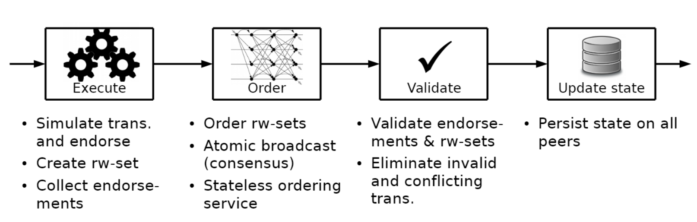
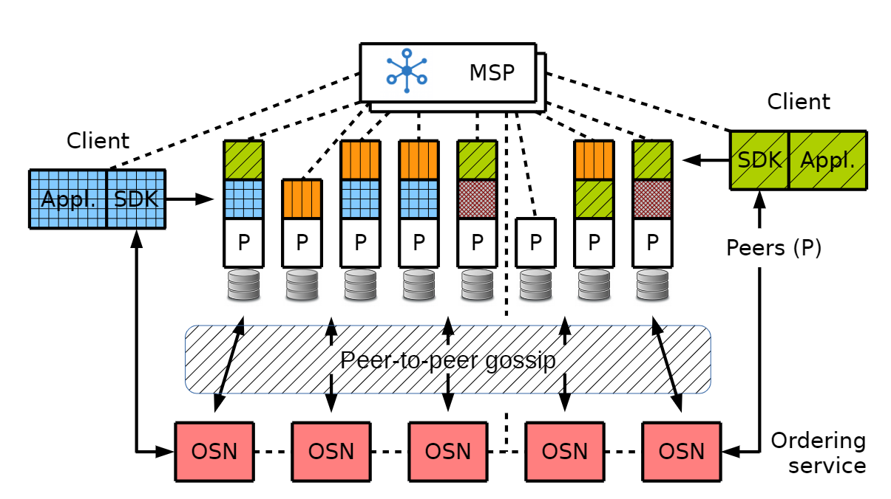
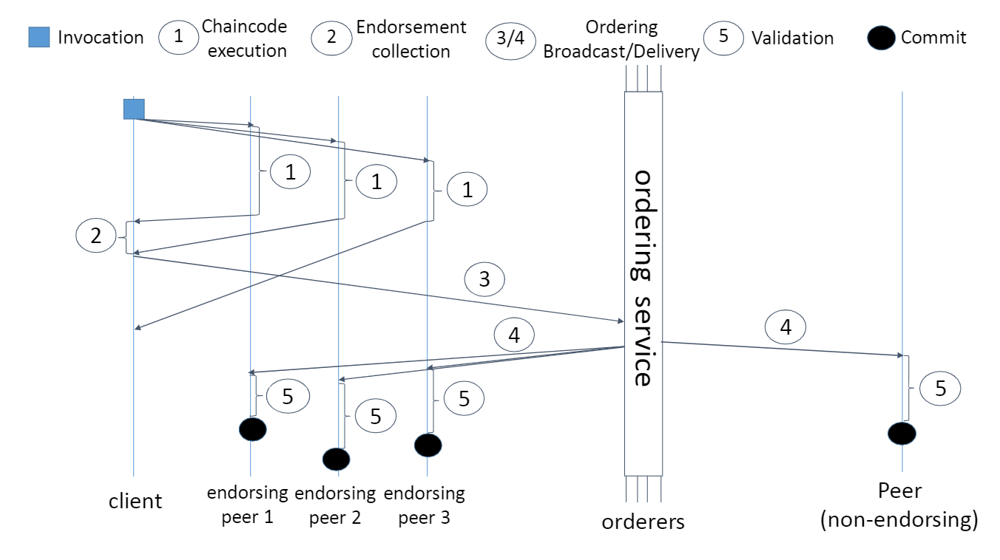
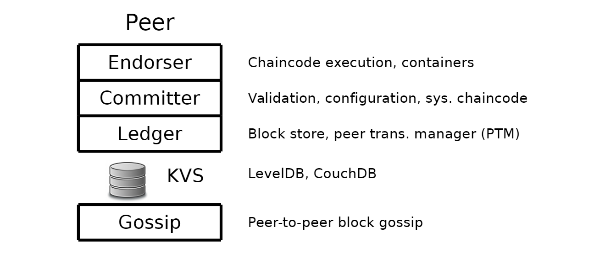

## 整体架构

本节参考了 [Hyperledger Fabric: A Distributed Operating System for Permissioned Blockchains](https://arxiv.org/abs/1801.10228) 论文。

根据官网对于 fabric 的一些定义，不难发现 fabric 与一般的构建弹性程序的方法别无二致。比如产生交易都是想要把 ledger 复制到不同的 peer 节点上，再通过一定的验证机制来保证数据的一致性和可靠性。但其实 fabric 与**普通的构建弹性程序的方法**——SMR（state-machine replication) 还是有几点区别的：

> (1) not only one, but many distributed applications run concurrently; 
>
> (2) applications may be deployed dynamically and by anyone; 
>
> (3) the application code isuntrusted, potentially even malicious.

1. 复制操作可能是并发的，甚至并行的。
2. 应用可能随时随地地被任何人部署。
3. 不能完全信任应用的代码，可能会存在应用恶意攻击的可能。

现在（提出 fabric 的那几年）很多支持智能合约的区块链走的都是 SMR 的老路—— active replication: 通过一个共识的或者能够保证原子传播的协议，这个协议先将事务排序，并且发送给所有的 peer，每个 peer 按照顺序执行这些事务。（note：交易、事务都被称为 transaction，此处语境使用交易或者事务都可用）

这样的操作被称为**顺序执行架构**；它要求所有节点执行每一个事务，并且所有事务都是确定性的。市面上几乎所有的区块链项目都是基于这样的架构，这导致了几个问题：

1. 采用的共识协议被硬编码到了平台中（区块链服务可被称为一个平台，Paas）。这样的做法是非常经典的“一刀切”，没有根据实际情况来选择不同的共识协议。
2. 如上所说，交易验证的信任模型是被共识协议决定的，不能修改共识协议意味着不能同时满足不同智能合约的需求。
3. 智能合约必须用特定的编程语言编写，这会阻碍社区的发展。
4. 要求所有节点顺序执行事务导致了性能瓶颈，并且可能会引来 dos（denial-of-service) 攻击
5. 交易必须是确定性的，这在程序上可能很难保证。
6. 每个智能合约运行在所有的 peer 节点上，这与保密性产生了冲突，并且拒绝把智能合约的代码传播给这个 peer 节点的子集。

因此，fabric 设计了一个新的架构来实现 resiliency, flexibility, scalability, confidentiality（弹性、灵活性、可扩展性和保密性），允许使用标准编程语言写的智能合约代码在不同的节点上一致地执行。因此，fabric 自称为**为联盟链设计的操作系统**。

这种架构允许不被信任的代码分布式地在不被信任的环境中执行，被称为 execute-order-validate 范式。它将交易流程分为三个步骤，可以在系统中的不同实体上运行：

1. 执行交易并检查其正确性，从而为它背书 (endorse)（对应其他区块链中的“交易验证”）；
2. 通过共识协议排序这些交易，而不是根据交易语义进行排序； 
3. 根据特定应用的信任假设进行交易验证，这也是为了防止并发带来的竞争。

针对复制，fabric 结合了两种主流的复制方式：被动复制和主动复制。

fabric 用的被动复制也可以被称为主从备份，在分布式数据库中非常常见，但是增加了**基于中间件的不对称更新（asymmetric update）处理**，并被移植到有拜占庭故障的不信任环境。在 fabric 中，每笔交易只需要一系列 peer 中的子集执行（背书）即可，这意味着可以并行地执行这些操作，并且解决了潜在的不确定性问题（借鉴了 execute-verify BFT 的流程）。灵活的背书策略可以适应不同的智能合约的需求，比如需要多少人来背书。

> In Fabric, every transaction is executed (endorsed) only by a subset of the peers, which allows for parallel execution and addresses potential non-determinism, draw-ing on “execute-verify” BFT replication
>
> **为什么可以解决 potential non-determinism** ？

fabric 的主动复制指的是每个单独的 peer 节点会单独执行一个具有决定性的验证步骤，交易只在这次验证达成**全序范围内的共识** (total order) 时才写入账本。这使得 fabric 可以根据不同的背书策略来建立不同的信任假设。

为了实现上述特性，fabric 设计了下面的几个模块：

* 排序服务（ordering service）： 自动向每个 peer 节点发送状态的更新，并基于交易的顺序建立共识。
* MSP（membership service provider）：将用户和加密后的身份联系起来
* peer-to-peer gossip service：通过排序服务来减少区块的输出（可选）
* 智能合约（smart contracts）：可以使用标准编程语言撰写，不会对账本的状态有直接的修改。每个智能合约都是运行在容器中，确保了隔离性。
* 账本（ledger）：每个 peer 本地都维护着仅追加的区块形式的账本，相当于是最近的 key-value 存储状态的一个快照。

下面详细介绍了一下之前提到的概念。

### Order-Execute 架构的问题

在 fabric 之前的区块链使用的都是 order-execute 架构。这意味着区块链网络先使用一个共识协议排序这些交易，所有 peer 节点再以这个相同的顺序执行这些交易。

比如需要工作量证明机制的区块链的执行流程如下：

1. 每个 peer 节点（即参与共识的节点）都会组成一个包含有效交易的区块（为了建立有效性，该对等体已经预先执行了这些交易）。
2. 这个 peer 节点尝试参与工作量证明。如果是比特币的话，这个步骤就是挖矿。
3. 如果这个节点挖到矿了，就会把自己的区块传播给其他的节点
4. 每个收到这个区块的节点都会验证这个结果是否正确，如果正确，则会按顺序执行这个区块里的交易，从而保证了顺序一致性。

**Sequential execution** 这种方式限制了区块链的吞吐量，而且吞吐量往往和延迟成反比，这意味着这一部分可能会成为区块链的性能瓶颈。分布式系统的文献中提出了许多解决方法来提升性能，比如并行执行不相关的操作。但是在区块链中，这些方法行不通。比如在推导这些操作之间的关系的时候，这可能会涉及到一些隐私性的内容，这与保密性相违背。而且，这种方法也不能解决来自不信任者的 Dos 攻击。

Order-Execute 架构的另一个问题是**非确定性事务**（交易）。在活跃的 SMR（state machine replication）中，经过共识协议后的操作必须是确定性的，否则会导致不同的节点有不同的状态。在以太坊中，是通过创建一种新的编程语言来实现这个需求的。但这也意味着需要额外的学习成本，那能不能用大家熟知的编程语言呢？

不幸的是，就算应用的编写者不自己写出一段具有不确定性的代码，通用编程语言的内部实现可能并不能保证结果是唯一的（即不能保证确定性），比如 Go 语言中的 map iterator。更糟糕的是，不能保证应用的编写者自己不出错，甚至是写出恶意的代码。

Order-Execute 架构还要考虑的一点是**执行的保密性（Confidentiality of execution）**。许可链中很多的使用场景都要求有保密性，即限制对智能合约逻辑、交易数据或者账本状态的访问。虽然加密技术（数据加密、灵芝是证明、可验证计算）可以实现保密性，但是这样的开销相当大。

幸运的是，能够将相同的状态传播给所有的 peer 就足够了，并不需要在每个 peer 上执行相同的代码。因此，执行一个智能合约的工作只需要所有 peer 的子集（这个子集是被信任的）来完成即可，他们能够为执行的结果做担保。这种设计根据区块链的信任模型把主动复制演变成了被动复制。

### 现有架构的问题

#### 信任模型是固定的-应当更加灵活

多数许可链依赖异步的 BFT 复制协议来建立共识。这种协议是基于不超过三分之一的节点失效（超过三分之二的节点正常运行）的安全假设的（即拜占庭容错）。在这种相同的安全假设下，尽管事实上可能只需要把 BFT 限制到少数几个节点，但相同的 peer 也经常执行应用程序。在这种环境中，可能仍然不能完全满足智能合约的需求。因为智能合约可能还会考虑每个 peer 的身份，来作为信任条件的一部分。因此，一个通用的区块链应该将协议上的信任和应用上的信任解耦，形成一个更加灵活的信任模型。

#### 共识协议是硬编码的-应该是可替换的

没有一个协议能够适应所有的场景，不同的 BFT 协议在不同的环境下的性能有非常大的差距。BFT 共识应该是天生可重新配置的，最好是能够动态适应环境的变化。另一个重要的点是应该将协议的信任假设与特定的区块链部署场景相匹配。事实上，人们可能想用一种基于其他信任模型的协议来取代 BFT 共识，如 XFT（cross fault tolerance），或 CFT(crash fault tolerance) 协议，如 Paxos/Raft 和 ZooKeeper，甚至是一种无许可协议。

### 改进后的 fabric

fabric 将一贯的 order-execute 两部曲修正成了 execute-order-validate 三部曲。

简言之，fabric 中的一个分布式应用包括两部分：

* 智能合约，也叫做链码。是应用的具体逻辑，在 execute 这个步骤的时候运行。链码是 fabric 分布式应用的重要部分，可能被不被信任的开发者编写。其中还包含一些特殊的链码，叫做系统链码（system chaincodes），主要负责管理区块链系统和维护变量。
* 在 validate 步骤时，一个背书策略会被启用。背书策略本身无法被不被信任的开发者修改，通常是作为静态库的形式使用，因此唯一能做的就是通过链码来设置一些背书策略的参数。只有被指定的管理者才有权利通过系统管理函数修改背书策略。一个典型的背书策略让链码确定一组有背书权的 peer 来进行背书操作（类比许可证发布中心）。背书策略在集合上使用单调的逻辑表达，比如 "五分之三 "或"(A∧B)∨C"。自定义背书政策可以实现任意的逻辑。

客户端向被背书策略指定的 peer 们发送交易，每个交易会被这些 peers 执行，并且其输出会被记录。这个步骤也叫做**背书**。执行完成后，交易就进入到了 order 的阶段，这个阶段使用了一个可插拔的共识协议来产生一个**被背书的**且**按 block 分组的**交易的全序序列。这个顺序广播给了所有的节点。

**主动复制完全是对于交易的输入进行排序，而 fabric 这里是对 在 execute 步骤计算出的交易的输出加上状态依赖进行排序。然后每个 peer 在 validate 阶段根据背书策略和执行的一致性来验证状态的变化。所有的 peer 会以同样的顺序来验证这些交易，并且这个验证是确定性的。**

在这个意义上，Fabric 在拜占庭模型中引入了一种全新的混合复制模式，它结合了被动复制（the pre-consensus computation of state updates）和主动复制（the post-consensus validation of execution results and state changes）。

fabric 还包含了一组来自网络（network） 的节点。

因为 fabric 是被许可的，所以所有参与网络的节点都有一个身份，由 MSP（membership service provider）模块提供。所有在网络中的节点承担着下面三个角色中的一个：

* 客户端在 execute 阶段开始时提交 transaction proposals，节点在 excute 阶段帮助协调，并且为排序阶段广播这些交易。
* Peers 执行 transaction proposals 并且验证 transactions。所有的 peer 都维护着区块链账本，也被称为 state。并不是所有的 peer 都会执行 transaction proposals，只有其中的子集（也就是上述的背书者）会这么做。
* 排序服务节点整体上构成了排序服务。简而言之，排序服务建立了 Fabric 中所有事务的全序，其中每个事务包含执行阶段计算的状态更新和依赖关系，以及背书者节点的加密签名。排序节点完全不知道应用程序的状态，也不参与交易的执行和验证。这种设计选择使 Fabric 中的共识尽可能地模块化，并简化了 Fabric 中共识协议的替换。

Fabric 网络实际上支持不同的区块链使用同一组排序服务。这样的区块链叫做 channel，并且可能有不同的 peers 作为他的成员。通道可以用来划分区块链网络的状态，但通道之间的共识是不协调的，每个通道中的交易总顺序与其他通道是分开的（不同的）。**认为所有排序节点都是可信的**的这么一个部署可以对所有的 peer 进行一个通道访问权限控制。

#### 执行

#### 排序

#### 验证

### fabric 组成元素

#### 成员服务（Membership Service）

#### 排序服务（Ordering Service）

#### Gossip 数据传播协议

#### 账本（Ledger）

每个 peer 节点都维护着账本和在持久化存储上的状态，使能了 simulation, validation 和 ledger-update 三个状态。大体上，它是由一个区块存储（block store）和一个事务管理器（peer transaction manager）组成的。

**区块存储**（block store）是交易区块的持久化版本，本质上是一组仅追加的文件。区块存储同时还维护着一些用于随机访问区块、事务的索引。

**PTM**（peer transaction manager）维护着带有版本号的以 (key, value) 形式存储的最新的状态。他保存着类似于（key，value，version）这样的一个由链码存储的三元组，保存着以 key 为主键的，最新的 value。version 字段包括区块序列号和区块内的交易（存储条目）的序列号。这样的设计使得 version 是唯一的，且单调递增的。PTM 使用 LevelDB 或者 CouchDB 来实现这么一个本地 kv 存储。

在模拟过程中，PTM 为事务提供最新状态的稳定快照。PTM 在 readset 中记录了由 GetState 访问的每个条目的元组 (key, ver)，在 writeset 中记录了由 PutState 更新的每个条目 (key, val)。此外，PTM 支持范围查询，为此它计算查询结果的加密哈希值（一组（key, ver)），并将查询字符串本身和哈希值添加到 readset 中。

对于交易验证环节，PTM 按顺序验证一个区块中的所有交易行为。这将检查一个交易是否与之前的任何交易（在该区块内或之前的）相冲突。对于 readset 中的任何一个键，如果 readset 中记录的版本与最新状态下的版本不同（假设所有先前的有效交易都已提交），那么 PTM 就会将该交易标记为无效。对于范围查询，PTM 重新执行查询，并将哈希值与 readset 中的哈希值进行比较，以确保不发生幻读。这种读写冲突模式导致了单拷贝序列化（one-copy serializability）。

账本组件允许在更新状态时发生下面的场景。ledger 组件在收到一个新区块之后，PTM 已经进行了验证，并在区块内使用 bit mask 将交易标记为有效或无效。现在账本组件将区块写入 block store，并且刷盘，然后更新 block store 的索引。然后，PTM 会把 writeset 中所有有效交易的状态变化应用到本地的带版本号的存储。最后，他会计算并且持久化一个叫做 savepoint 的值，表示最大的已经应用到状态的区块号。savepoint 是用来在出现故障时恢复到最新状态的。

#### 执行链码

#### 配置和系统链码
