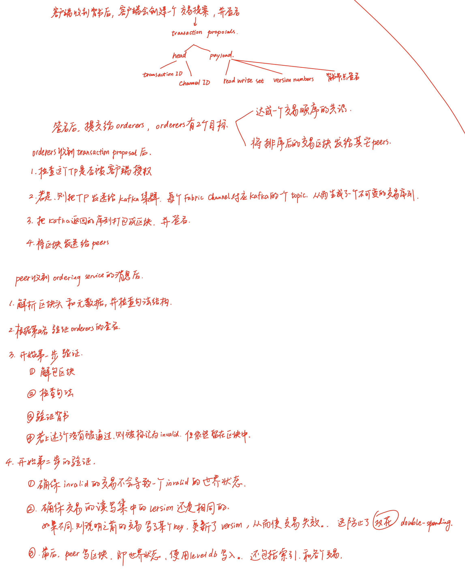

本节参考了 [FastFabric: Scaling Hyperledger Fabric to 20,000 Transactions per Second](https://arxiv.org/abs/1901.00910) 论文。

## 回顾

在讨论该论文对于 Fabric 的优化之前，我们先回顾一下 Fabric 的整体架构。

在 Fabric 的网络中有上图所示的几个重要的概念：peer 节点、ledger 账本、smart contrast 智能合约、orderer 排序节点、由排序节点提供的排序服务、网络、联盟、通道。

根据上一篇文章，我们可以知道 Fabric  提出的 execute-order-validation 架构的整体流程

0. 客户端发起一个 transaction proposal。

1. 背书者们（endorsers) 收到这个 proposal 后，计算这个 transaction 的读写集，对其加密，返回给客户端（proposal response）。
2. 客户端收集这些 proposal response。
3. 当满足背书条件时，会将 proposal response 发送给排序服务。
4. 排序节点将传入的 transaction 进行排序，然后将这个队列分割成区块。并将其发送给所有的 peer 节点（包括 endorser 和非 endorser）。
5. 所有的 peer 节点验证这些交易，若验证成功则提交。

下面针对 order-validate 这两个步骤详细说明：

