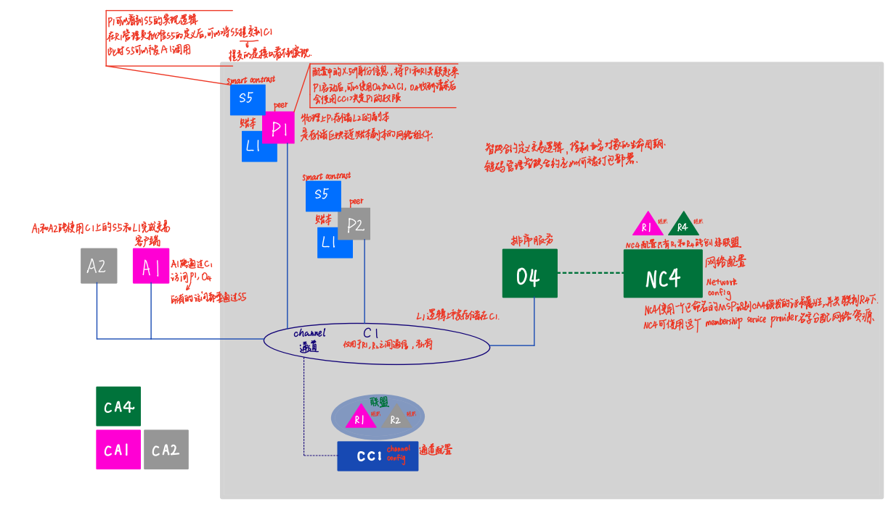
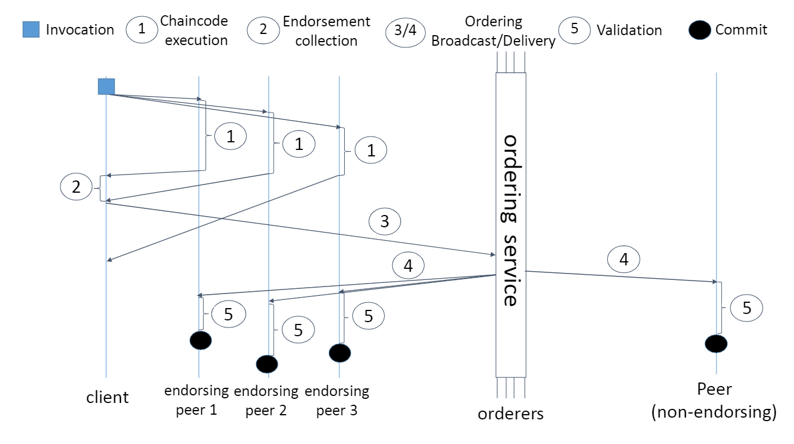
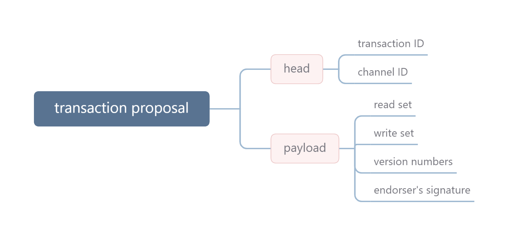

本节参考了 [FastFabric: Scaling Hyperledger Fabric to 20,000 Transactions per Second](https://arxiv.org/abs/1901.00910) 论文。

## 回顾

在讨论该论文对于 Fabric 的优化之前，我们先回顾一下 Fabric 的整体架构。

在 Fabric 的网络中有上图所示的几个重要的概念：peer 节点、ledger 账本、smart contrast 智能合约、orderer 排序节点、由排序节点提供的排序服务、网络、联盟、通道。

根据上一篇文章，我们可以知道 Fabric  提出的 execute-order-validation 架构的整体流程

0. 客户端发起一个 transaction proposal。

1. 背书者们（endorsers) 收到这个 proposal 后，计算这个 transaction 的读写集，对其加密，返回给客户端（proposal response）。
2. 客户端收集这些 proposal response。
3. 当满足背书条件时，会将 proposal response 发送给排序服务。
4. 排序节点将传入的 transaction 进行排序，然后将这个队列分割成区块。并将其发送给所有的 peer 节点（包括 endorser 和非 endorser）。
5. 所有的 peer 节点验证这些交易，若验证成功则提交。

下面针对 order-validate 这两个步骤详细说明：

客户端收到足够的 proposal response 后，会将 transactions 打包、签名然后发送给排序服务，包含的内容如下图所示。

排序服务有两个职责：

1. 将这些交易排序，达成一个顺序的共识
2. 将排序后的交易区块发送给所有的 peer

orderers 收到 transaction proposal 后，会进行以下几个操作：

1. 检查 transaction proposal 是否被客户端授权
2. 如果已经授权，则将这个 transaction proposal 发送给 Kafka 集群。每个 Fabric Channel 都对应着一个 Kafka topic。在 Fabric v2.0 后，已经建议将 raft 作为 [排序服务的底层实现](https://hyperledger-fabric.readthedocs.io/zh_CN/latest/orderer/ordering_service.html)。每个通道都在 Raft 协议的**单独**实例上运行，该协议允许每个实例选择不同的领导者。
3. 将 Kafka（raft）返回的交易序列打包成区块，并签名
4. 将区块发送给 peers。可以只发送给少数的 peer，其余的通过 gossip 协议传播。

在 peer 收到排序服务的消息后：

1. 解析区块头和元数据，并且检查其句法结构（syntactic  structure）。
2. 根据指定的 policy 验证 orderers 的签名。
3. 第一步验证：
   1. 解包区块
   2. 检查句法
   3. 验证背书
   4. 若上述 3 个没有被通过，则标记该交易为 invalid，但仍然留在区块中
4. 第二步验证
   1. 确保 invalid 的交易不会产生一个 invalid 的世界状态
   2. 确保交易的 rwset 中的 version 是相同的。如果不同，则说明之前的交易写了某个 key，更新了 version，从而使交易失效。这个操作防止了 double-spending 的发生
5. 第三步，peer 将区块写入账本，更新世界状态。
6. 最后，区块被加入到一个队列中，追加到当前的区块链中。

## 前言

在 Hyperledger 中使用 BFT 共识算法的代价很高，往往会成为性能的瓶颈。因为 BFT 共识算法很难有很好的可扩展性。除此之外：

- 在许可链中没有使用BFT算法的必要。因为在许可链中参与者的身份和信息都是可知的，不会像公链中那样出现恶意节点。
- BFT 共识已经有很多人研究，在未来（论文发布于2019年）可能会有更高的吞吐量解决方案。
- Fabric v1.2 中没有使用 BFT 共识算法，而是使用了 Kafka 作为交易排序的服务。

该论文针对排序服务进行了两个优化，剩余的优化是针对 peer 的。

## Orderer的改进

### 将 transcation header 与 payload 分离

在 Fabric v1.2 中，orderers 将整个交易都发给了 Kafka 来排序。每个交易可能有好几个 KB，给网络带来了负担。但是，要使所有的交易有序只需要交易ID即可进行排序，所以一个非常显著的提升就是将原来的**发送整个交易**修改为**只发送交易ID**给Kafka集群。

orderers 在收到客户端发送的交易后，将 transaction ID 从 交易头里取出来，然后发送给 Kafka 集群。其对应的 payload 是被存储在本地的数据结构中（估计是一个哈希表，key 是 transaction ID，value 是 payload）。等Kafka集群返回 ID 后，再将两者组装起来。随后，就像原来一样，orderers将交易集分割成块，并将其交付给peer节点。这样的改进不需要对原有的架构进行修改。

### Message pipelining

在 Fabric v1.2 里，排序服务是一个一个处理客户端发来的交易的。当一个交易来的时候，识别出了它对应的channel，在通过了一系列的检查之后，会被转发到共识系统里。

类似于指令执行时大致可以分为取指、译码、执行、访存、写回 5 个步骤，可以流水线化。这里同理。

为此，我们维护一个线程池，并行处理传入的请求，每个传入的请求有一个线程。一个线程调用 Kafka API来发布交易ID，并在成功后向客户端发送一个响应。下图展示了论文对于 orderer 的优化。

## Peer 的任务

一个 peer 节点有以下几个任务：

- 验证接收到的消息的合法性
- 验证块头和块中每个交易的每个背书签名
- 验证交易的读写集
- 更新 LevelDB 或 CouchDB 中的世界状态
- 使用 LevelDB 中的对应索引将区块链日志存储在文件系统中

优化的目的是尽可能地在某个交易流程上增加交易的吞吐量。论文团队观察到，首先，验证一个交易的读写集需要快速访问世界状态。 因此，我们可以通过使用内存哈希表而不是数据库来加快这一过程。

第二，交易流程中不需要区块链日志，所以我们可以在交易流程结束后将其存储到一个专门的存储和数据分析服务器上。

第三，如果一个peer节点也是一个背书节点，它需要处理新的transaction proposal。然而，committer和endorser的角色是不同的，这使得为每项任务提供不同的物理硬件成为可能。 

第四，传入的区块和事务必须在peer节点得到验证和解决。 最重要的是，通过事务写集对状态变化的验证必须按顺序进行，阻塞所有其他任务。因此，尽可能地提高这个任务的速度是很重要的。

最后，通过缓存Protocol Buffers解析块的结果可以获得显着的性能提升。总体的改进结果如下图所示：

### 将世界状态数据库替换为哈希表

世界状态数据库必须为每一个交易依次查询和更新，以保证所有对等体的一致性。 因此，以尽可能高的交易率更新该数据存储是至关重要的。我们认为，对于常见的场景，如跟踪钱包或资产的分类账，世界状态可能相对较小。 即使需要存储数十亿的key value，大多数服务器也可以轻松地将它们保存在内存中。因此，我们建议使用内存哈希表，而不是用LevelDB或者CouchDB来存储世界状态。这样，在更新世界状态时，就可以消除硬盘访问。它还消除了昂贵的数据库系统保证（即ACID属性），由于区块链本身的冗余保证，这些保证是不必要的，进一步提高了性能。但是，在非持久化的内存里存储数据比较容易出现错误（如宕机），所以，内存里的哈希表必须以持久化的存储作为辅助，在下一节详细讨论。

### 用peer集群存储区块

根据定义，区块是不可变的。这天然地适合仅追加形式的数据存储方式。通过将数据存储与peer节点的的其余任务解耦，我们可以为区块和世界状态备份提供多种类型的数据存储，包括像Fabric目前所做的那样，在单个服务器的文件系统中存储区块和世界状态的备份（leveldb、couchdb）。为了最大化可扩展性，论文建议使用一个分布式存储集群。请注意，在这个解决方案中，每个存储服务器只包含链的一部分，这促使我们使用分布式数据处理工具，如Hadoop MapReduce或Spark。

### 将commitment和endorsement分离

在 Fabric v1.2中，背书节点同样需要提交区块。endorsement 和 commitment 是两个代价相当高的操作。虽然背书集群上的并发交易处理有可能提高应用程序的性能，但在每个新节点上都需要commit区块实际上抵消了这些好处。因此，论文建议将这些角色分割开来。

具体来说就是，committer peer（即非endorser）执行验证流水线，然后将验证后的区块发送给endorsers，这些endorsers只需要将这些变化写入到自己的世界状态中，不需要另外去验证了。这个步骤使我们能够释放endorser的部分组员。在这样的背书节点集群中，可以自由地横向扩容（因为commitment 和 endorsement解耦了），可以将背书节点放到专用的硬件上。

### 并行化validation

区块和transaction header的验证都需要检查发送者的权限、执行的背书政策和语法验证。这些都是高度可并行化的。论文引入了完整的validation pipeline来扩展 Fabric v1.2的并发程度。

具体来说，对于每个传入的区块，都分配一个goroutine来引导它通过区块验证阶段。随后，这些goroutine中的每一个都利用了Fabric 1.2中已经存在的用于交易验证的goroutine池。 因此在任何时候，多个区块和它们里面的交易都会被并行地检查是否有效。最后所有的读写集被一个的goroutine按正确的顺序进行验证。这使我们能够利用多核服务器CPU的全部潜力。

### 缓存解析后的区块

Fabric使用gRPC在网络中的节点之间进行通信。 为了准备数据的传输，协议缓冲区被用来进行序列化。为了能够处理应用程序和软件的长期升级，Fabric的区块结构是高度分层的，每一层都是单独的marshaled和unmarshaled。这导致了大量的内存被分配，以将字节数组转换为数据结构。此外，Fabric v1.2没有在缓存中存储以前unmarshaled的数据，所以每当需要数据时，就必须重新进行这项工作。

为了缓解这个问题，我们提出了一个未加密数据的临时缓冲区。在验证过程中，数据块被存储在缓存中，并在需要的时候按照block number进行检索。 一旦区块的任一部分被unmarshal，它就会和区块一起被存储起来以便重复利用。 论文使用了一个循环的缓冲区，这个缓冲区和 validation pipeline 一样大。每当一个区块被提交，一个新的区块就可以进入流水线，并自动覆盖已提交区块的现有缓存。 由于提交后不需要缓存，并且保证新区块只在旧区块离开流水线后到达，所以这是一个安全的操作。请注意，unmarshal只将数据添加到缓存中，而不是改变它。 因此，可以对validation  pipeline 中的所有程序进行无锁访问。 在最坏的情况下，多个程序试图访问相同的（但尚未unmarshal的）数据，并且所有程序都并行地执行unmarshal。然后，最后一个写到缓存的程序写了最终的结果，这也没啥问题。

数据流图分析表明及时有了上述的优化，由于unmarshal导致的内存分配、释放依然是整个执行流程中时间占比最大的部分。如果想要进一步优化，则需要修改gRPC的调用管理、加解密计算。这两个部分超出了论文的工作范围。

## 未来工作展望

- Incorporating an efficient BFT consensus algorithm suchas RCanopus
- Speeding  up  the  extraction  of  transaction  IDs  for  the orderers without unpacking the entire transaction headers
- Replacing the existing cryptographic computation library with a more efficient one
- Providing  further  parallelism  by  assigning  a  separate ordering and fast peer server per channel
- Implementing  an  efficient  data  analytics  layer  using  a distributed framework such as Apache Spark
