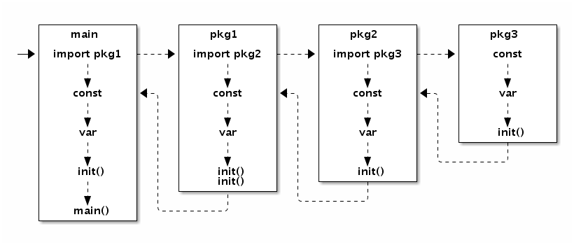

个人链接汇总：[https://www.lincyaw.xyz](https://www.lincyaw.xyz)

主要参考文档：[Go语言高级编程](https://chai2010.cn/advanced-go-programming-book/)、[Go语言官网](https://pkg.go.dev/)

---

golang 使用了 CSP 并发模型。CSP(Communicating Sequential Process) 模型提供一种多个进程公用的“管道(channel)”, 这个 channel 中存放的是一个个“任务”。一个Goroutine会以一个很小的栈启动（可能是2KB或4KB），当遇到深度递归导致当前栈空间不足时，Goroutine会根据需要动态地伸缩栈的大小（主流实现中栈的最大值可达到1GB）。

> Goroutine 快的原因

Go的运行时还包含了其自己的调度器，这个调度器使用了一些技术手段，可以在 n 个操作系统线程上多工调度 m 个 Goroutine。Go 调度器的工作和内核的调度是相似的，但是这个调度器只关注单独的 Go 程序中的 Goroutine。Goroutine 采用的是半抢占式的协作调度，只有在当前 Goroutine 发生阻塞时才会导致调度；同时发生在用户态，调度器会根据具体函数只保存必要的寄存器，切换的代价要比系统线程低得多。运行时有一个 runtime.GOMAXPROCS 变量，用于控制当前运行正常非阻塞 Goroutine 的系统线程数目。

## 单例模式的实现

我在实习的过程中，一个同事写了一份模板代码，有一个 package 封装了 logrus 库，然后加上了自己的 log 信息。其中出现的问题就是，从这个 package 获取的 logger 指针是空指针。原因就在于没有正确地使用单例模式。下面给出正确的例子：

package1：
```go
package pack1
import "sync"
var (
	instance *singleton
	once     sync.Once
)
type singleton struct {
	Name string
	Age  int
}
func Instance() *singleton {
	once.Do(func() {
		instance = &singleton{
			Name: "father",
			Age: 30,
		}
	})
	return instance
}
```

main：
```go
package main
import (
	"awesome/pack1"
	"fmt"
)
func main() {
	a := pack1.Instance()
	fmt.Println(a)
	a.Age = 40
	b := pack1.Instance()
	fmt.Println(b)
}
```

打印的结果如下所示，证明了代码的正确性：
```
&{father 30}
&{father 40}
```

## sync/atomic 包

在 [mit 6.824 实验](http://nil.csail.mit.edu/6.824/2020/schedule.html)中，面临着并发读写的情况。此时使用这个包是很好的选择，这个包提供了对于内置数据类型的原子操作。同时，也允许用户自定义结构体来实现自定义原子读写。

atomic.Value 定义如下，相当于只是在 interface 外面套了一个 struct

```go
type Value struct {
	v interface{}
}
func (v *Value) Load() (x interface{})
func (v *Value) Store(x interface{})
```

示例程序：

```go
package main
import (
	"fmt"
	"reflect"
	"sync/atomic"
)
type TestStruct struct {
	Name string
}
func main() {
	var t atomic.Value
	t.Store(TestStruct{Name: "Alice"})

	ans := t.Load()
	fmt.Println(ans)
	fmt.Println(reflect.ValueOf(ans))
	fmt.Println(reflect.TypeOf(ans))
}
// 结果为：
// {Alice}
// {Alice}
// main.TestStruct
```


## 顺序一致性

关于顺序一致性的定义可以看[这篇文章](http://kaiyuan.me/2018/04/21/consistency-concept/)。这个定义实际上对系统提出了两条访问共享对象时的约束：

1. 从单个处理器（线程或者进程）的角度上看，其指令的执行顺序以编程中的顺序为准；
2. 从所有处理器（线程或者进程）的角度上看，指令的执行保持一个单一的顺序；

在 Go 语言中，同一个Goroutine线程内部，顺序一致性内存模型是得到保证的。但是不同的Goroutine之间，并不满足顺序一致性内存模型，需要通过明确定义的同步事件来作为同步的参考。如果两个事件不可排序，那么就说这两个事件是并发的。为了最大化并行，Go语言的编译器和处理器在不影响上述规定的前提下可能会对执行语句重新排序（CPU也会对一些指令进行乱序执行）。

因此，在并发编程时，如果想要使主线程和子线程之间协作的话，使用管道或者锁用来实现同步是必要的。


### package 的初始化



package 的初始化流程**满足顺序一致性**。因为在`main.main`函数执行之前所有代码都运行在同一个 Goroutine 中，也是运行在程序的主系统线程中。如果某个`init`函数内部用 go 关键字启动了新的 Goroutine 的话，新的 Goroutine 和`main.main`函数是并发执行的，这样就不能保证顺序一致性。

## 常见并发模型

### 生产者消费者模型

最常见的模型。

```go
// 生产者: 生成 factor 整数倍的序列
func Producer(factor int, out chan<- int) {
    for i := 0; ; i++ {
        out <- i*factor
    }
}

// 消费者
func Consumer(in <-chan int) {
    for v := range in {
        fmt.Println(v)
    }
}
func main() {
    ch := make(chan int, 64) // 成果队列

    go Producer(3, ch) // 生成 3 的倍数的序列
    go Producer(5, ch) // 生成 5 的倍数的序列
    go Consumer(ch)    // 消费 生成的队列

    // 运行一定时间后退出
    time.Sleep(5 * time.Second)
}
```

### 发布/订阅模型

订阅者在订阅时，需要指定一个过滤器（函数），来决定自己要订阅什么消息。

发布者在发布消息时，会先调用订阅者的过滤器，如果符合订阅者的要求，则把消息发送给订阅者（发送到 channel 中）。

代码分为 main.go 以及 pubsub package。

```go
// Package pubsub implements a simple multi-topic pub-sub library.
package pubsub

import (
   "sync"
   "time"
)

type (
   subscriber chan interface{}         // 订阅者为一个管道
   topicFunc  func(v interface{}) bool // 主题为一个过滤器
)

// 发布者对象
type Publisher struct {
   m           sync.RWMutex             // 读写锁
   buffer      int                      // 订阅队列的缓存大小
   timeout     time.Duration            // 发布超时时间
   subscribers map[subscriber]topicFunc // 订阅者信息
}

// 构建一个发布者对象, 可以设置发布超时时间和缓存队列的长度
func NewPublisher(publishTimeout time.Duration, buffer int) *Publisher {
   return &Publisher{
      buffer:      buffer,
      timeout:     publishTimeout,
      subscribers: make(map[subscriber]topicFunc),
   }
}

// 添加一个新的订阅者，订阅全部主题
func (p *Publisher) Subscribe() chan interface{} {
   return p.SubscribeTopic(nil)
}

// 添加一个新的订阅者，订阅过滤器筛选后的主题
func (p *Publisher) SubscribeTopic(topic topicFunc) chan interface{} {
   ch := make(chan interface{}, p.buffer)
   p.m.Lock()
   p.subscribers[ch] = topic
   p.m.Unlock()
   return ch
}

// 退出订阅
func (p *Publisher) Evict(sub chan interface{}) {
   p.m.Lock()
   defer p.m.Unlock()

   delete(p.subscribers, sub)
   close(sub)
}

// 发布一个主题
func (p *Publisher) Publish(v interface{}) {
   p.m.RLock()
   defer p.m.RUnlock()

   var wg sync.WaitGroup
   for sub, topic := range p.subscribers {
      wg.Add(1)
      go p.sendTopic(sub, topic, v, &wg)
   }
   wg.Wait()
}

// 关闭发布者对象，同时关闭所有的订阅者管道。
func (p *Publisher) Close() {
   p.m.Lock()
   defer p.m.Unlock()

   for sub := range p.subscribers {
      delete(p.subscribers, sub)
      close(sub)
   }
}

// 发送主题，可以容忍一定的超时
func (p *Publisher) sendTopic(
   sub subscriber, topic topicFunc, v interface{}, wg *sync.WaitGroup,
) {
   defer wg.Done()
   if topic != nil && !topic(v) {
      return
   }

   select {
   case sub <- v:
   case <-time.After(p.timeout):
   }
}
```

```go
package main
import (
   "awesome/pubsub"
   "fmt"
   "strings"
   "time"
)
func main() {
   p := pubsub.NewPublisher(100*time.Millisecond, 10)
   defer p.Close()
   all := p.Subscribe()
   golang := p.SubscribeTopic(func(v interface{}) bool {
      if s, ok := v.(string); ok {
         return strings.Contains(s, "golang")
      }
      return false
   })
   p.Publish("hello,  world!")
   p.Publish("hello, golang!")
   go func() {
      for  msg := range all {
         fmt.Println("all:", msg)
      }
   } ()
   go func() {
      for  msg := range golang {
         fmt.Println("golang:", msg)
      }
   } ()
   // 运行一定时间后退出
   time.Sleep(3 * time.Second)
}
```


## 优雅退出 Goroutine

- select, default + waitgroup + channel
- select, default + context

第一种 e.g：

```go
func worker(wg *sync.WaitGroup, cannel chan bool) {
    defer wg.Done()

    for {
        select {
        default:
            fmt.Println("hello")
        case <-cannel:
            return
        }
    }
}

func main() {
    cancel := make(chan bool)

    var wg sync.WaitGroup
    for i := 0; i < 10; i++ {
        wg.Add(1)
        go worker(&wg, cancel)
    }

    time.Sleep(time.Second)
    close(cancel)
    wg.Wait()
}
```

第二种 e.g：

详见另一篇文章，[Context包的使用](http://lincyaw.xyz/blog/p/golangcontext%E5%8C%85/)。

## 并发编程实践

在 6.824 实验中，有一个场景是：

1. candidate 向所有的 slave 发送选举请求。
2. 超过半数的 slave 同意选举，则该 candidate 成为 master。

但有可能存在的问题是，slave 可能已经掉线了，无法成功回复 candidate 的请求。因此 candidate 向 slave 发送的请求应当是异步的，否则就会在等待回复的过程中消耗大量的时间，从而引发许多问题。

因此，一开始我的写法是像下面的伪代码一样：

```go
replies := make([]RequestVoteReply, len(rf.peers))
for idx, server := range rf.peers {
    go func() {
        ok := server.Call("Raft.RequestVote", &args, &(replies[idx]))
        if !ok {
            logger.Warn(rf.me, "给 ", idx, " 发的选举没有得到回复")
        } else {
            logger.Trace(rf.me, " 收到选举回复")
        }
    }()
}

time.Sleep(1*time.Second)

for idx, v := range replies {
    if v.VoteGranted {
        // 同意选举
    }
    if v.Term > term {
        // 不同意选举
    }
}
```

通过 replies 来收集各个 slave 的回复情况。第一个 for 循环是调用 rpc，`server.Call`。slave 的回复会写入到对应的 `replies[idx]`。主线程在启动了数个协程之后，睡眠 1 秒钟，等待能够正常回复的 slave 进行回复。（掉线的永不回复，因此我们不能无限等待）第二个 for 循环则是统计选举的情况。

但是这样就存在了读写问题，协程里在写，而主线程在读。谁也不能保证 slave 是因为**网络延迟问题**没有回复还是因为**掉线**而没有回复。

因此，这成了一个亟待解决的问题。

在学习了 context 以及上面的内容之后，我决定使用通道 + context with timeout 来传输数据和停止协程。

初步的写法如下：

```go
replies := make(chan RequestVoteReply, len(rf.peers))
for idx, server := range rf.peers {
    ctx, cancel := context.WithTimeOut(context.Background(), 1*time.Second)
    go func() {
        select {
            case <-ctx.Done():
            return;
            default:
            rep := RequestVoteReply{}
            ok := server.Call("Raft.RequestVote", &args, &(rep))
            replies <- rep
            if !ok {
                logger.Warn(rf.me, "给 ", idx, " 发的选举没有得到回复")
            } else {
                logger.Trace(rf.me, " 收到选举回复")
            }
        }
    }()
}

time.Sleep(1*time.Second)

for v := range replies {
    if v.VoteGranted {
        // 同意选举
    }
    if v.Term > term {
        // 不同意选举
    }
}
```

但不幸的是，协程会直接进入 default 分支，并且如果触发了 ctx.Done，也不会再进入 ctx 的分支。那能不能把 rpc 挪到分支判断里执行呢？经过尝试，是可以的。既然 select 只能用于管道操作，那我们就加个管道嘛！只要将函数的返回值输入到一个管道里，作为缓冲的等待机制即可。

因此代码修改如下：

```go
reps := make(chan RequestVoteReply, len(rf.peers))
chanLock := sync.Mutex {}
for idx, server := range rf.peers {
    ok := make(chan bool, 1)
    go func() {
        rep := RequestVoteReply{}
        select {
            case <- time.After(100 * time.Millisecond):
            return
            case ok <- server.Call("Raft.RequestVote", &args, &(rep)): // 最重要的逻辑
            // 处理返回成功
            if <-ok {
				chanLock.Lock()
                reps <- rep
                chanLock.Unlock()
            }
        }
    }()
}
time.Sleep(100 * time.Millisecond)
chanLock.Lock()
close(reps)
chanLock.Unlock()
for v := range reps {
   if v.VoteGranted {
   }
   if v.Term > term {
   }
}
```

值得注意的是，对于管道的 close 操作，我加了一把锁。原因是在 close 的过程中可能还存在向管道写的操作。

具体的代码在我这次的 [commit](https://github.com/Lincyaw/6.824/commit/67c464c4bedb731c6534686d3f7450bcb0644625#) 当中，我认为这次的代码修改给我带来了一个非常好的并发编程的学习过程。

