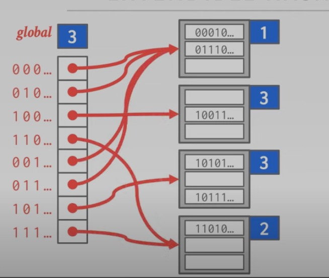

哈希表是数据库中的重要数据结构，其平均操作时间代价为 O(1)，空间代价为 O(n)。一个哈希表应该具备两个部分：

1. 哈希函数：如何将一个较大的键空间映射到一个更小的域。需要考虑“哈希函数的计算速度”与“冲突概率”之间的折中。
2. 哈希方案：如何处理哈希冲突。需要考虑“使用更大的哈希表空间来解决冲突”和“使用更多的计算步骤来解决冲突”之间的折中。

## 静态哈希冲突解决方案

静态哈希意味着哈希表的大小是固定的，如果想要改变大小，就需要重新构建一个更大的哈希表。一般来说新的哈希表的大小是原来的 2 倍。

### Linear Probe Hashing

线性探测哈希，该哈希方式是按顺序来解决冲突的。下方的右边是一列 slot，用于存放哈希表哈希后的数据。假设哈希函数是一个将 [-n,n] 空间映射到 [0,4] 空间函数，如`f(x)=n%5`。

现在哈希表里有一个 [1,4] 的键值对，`1%5==1`, 因此它存在 index 为 1 的位置。
```
             __________________
            |___<key>|<value>__|
[1,4]------>|_____<1>|<4>______|
            |__________________|
```

现在插入 [11,234]，`11%5=1`，与刚刚插入的 [1,4] 出现了冲突，则 [11,234] 线性地往下找空闲的空间。

```
             __________________
            |___<key>|<value>__|
[1,4]------>|_____<1>|<4>______|
[11,234]--->|____<11>|<234>____|
            |__________________|
```

现在插入 [2,2]，`2%5=2`, 与 [11,234] 产生了冲突，则继续往下找空闲位置。

```
             __________________
            |___<key>|<value>__|
[1]-------->|_____<1>|<4>______|
[11]------->|____<11>|<234>____|
[2]-------->|_____<2>|<2>______|
            |__________________|
```

该方法的查找策略是，如果哈希出来的 slot 是空的，则表示没有这个 key；如果哈希出来的 slot 存的不是自己的 key 则线性地往下找，直到找到结果，或者找到空的。

在删除 key 时，假设我们删除 [1,4]，则结果如下：

```
             __________________
            |___<key>|<value>__|
            |__________________|
[11]------->|____<11>|<234>____|
[2]-------->|_____<2>|<2>______|
            |__________________|
```

此时，如果要找 key 为 11 的键值对，`11%5=1`，而 index 为 1 的 slot 为空，按照上述查找方案显然不对，因为 key 为 11 的键值对是存在的。因此，为了避免上述现象，有两种解决方案：

1. 将删除数据的 slot 标记为墓碑（Tombstone），这样算法就能够知道继续向下找。
2. 将下面的数据往上移动。

经过方法二的移动后，结果如下。此时数据的查找能够对上。
```
             __________________
            |___<key>|<value>__|
[11]------->|____<11>|<234>____|
[2]-------->|_____<2>|<2>______|
            |__________________|
```

但这种实现方法需要注意的是，哈希表的这些 slots buffer 在逻辑上往往是以一个环形的方式组织的。即可以将这些 slots 认为是链表组成的环。则考虑下面的情况：slots 里存了 [10,2]。

```
             __________________
[10]------->|_____<10>|<2>_____|
            |__________________|
```

在移动键值对时，要注意不能把 [10,2] 往前移动（移动到了 slots 的最后一项。这样会导致 [10,2] 在查找时找不到（根据上面提到的查找策略会查找失败）。

```
             __________________
            |__________________|
[10]------->|_____<10>|<2>_____|
```

### Robin Hood Hashing

> Robin Hood 是欧美的一个民间传说，说的是这个人劫富济贫，让大家共同富裕。

思考线性探测的缺点，不难发现“一有冲突就将新加入的键往后移”的策略会导致部分键的查找时间会非常长，甚至可能到 O(n) 的时间复杂度。Robin Hood 做的事情就是对比发生冲突的两个键与它们真正位置的距离，距离相对较短的键往后移，使两者更加平均。

### Cuckoo Hashing

该方法是使用两个 hash 函数（或者用相同的 hash 函数，但是 seed 不同）来产生两个映射位置不同的哈希表，通过下述抢占的方式来减少冲突概率。 

1. 对 key 值 hash，生成两个 hash key 值，hashk1 和 hashk2, 如果对应的两个位置上有一个为空，那么直接把 key 插入即可。
2. 否则，任选一个位置，把 key 值插入，把已经在那个位置的 key 值踢出来。
3. 被踢出来的 key 值，需要重新插入，直到没有 key 被踢出为止。

Cuckoo 中文名叫布谷鸟，这种鸟有一种即狡猾又贪婪的习性，它不肯自己筑巢， 而是把蛋下到别的鸟巢里，而且它的幼鸟又会比别的鸟早出生，布谷幼鸟天生有一种残忍的动作，幼鸟会拼命把未出生的其它鸟蛋挤出窝巢，今后以便独享“养父 母”的食物。借助生物学上这一典故，cuckoo hashing 处理碰撞的方法，就是把原来占用位置的这个元素踢走，不过被踢出去的元素还要比鸟蛋幸运，因为它还有一个备用位置可以安置，如果备用位置上 还有人，再把它踢走，如此往复。直到被踢的次数达到一个上限，才确认哈希表已满，并执行 rehash 操作。

## 动态哈希策略

### Chained Hashing

这种方式可以简单理解为 slot 是一个链表，所有映射到这个 slot 上的键值对都会被追加到这个链表里。一个实现例子是：bucket 是一页（4KB），每一页以链表的形式存放。


这个链表可以无限增长，因此也存在着查找速度慢的可能性。

### Extendible Hashing 

因为 Chained Hashing 的链表会无限增长，导致可能查找速度慢。因此该方法是对其进行改进，使链表可以分裂，来减少链表的长度。

该方法是用 bit 位来进行引流：global 使用 2bit 来标志，第一个 local 用 1bit 来标志，这意味着 00，01 都是指向的第一个 local bucket。

假设我们要找到 key A 的 value，hash(A) 的结果是 01110，前两位是 01。查找 global slot，发现指向了第一个 local bucket，然后再去这个 bucket 里遍历，找到想要的数据。


现在想要插入 C，发现第二个 bucket 没有空余空间了，因此将 global 的 2 变成 3。再对原来的第二个 bucket 进行 remap，映射到新的第 2、3 个 bucket，就完成了分裂。



删除操作与插入操作完全相反，即可完成合并。

### Linear Hashing

哈希表维护一个指针，这个指针之上的 bucket 全都是已经分裂的，之下的是尚未分裂的。一旦有任意一个 bucket 满了（超过容量比例），就分裂指针指向的 bucket，然后指针往下移一个。


现在要插入 17，17%4=1，但是 index 为 1 的 bucket 已经满了，所以要触发分裂。根据指针，首先分裂的是 index 为 0 的 bucket。


扩张做的事情就是：添加一个 slot，这个 slot 的哈希函数是`hash(key)=key%2n`，作用是将映射范围扩张一倍。然后将扩张的那个 bucket 重新映射一遍。`8%4=0,20%8=4`，因此下图展示了上述效果。


此时，分裂分界点就移到了 index 为 1 的 slot 上。此时如果进行 find 20 的操作，则步骤如下：
1. 20%4=0，此时发现 0 小于分界点，则知道了 hash 函数应该使用`key%2n`的版本。
2. 20%8=4，此时成功找到了 key 为 20 的键值对。


