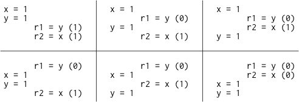
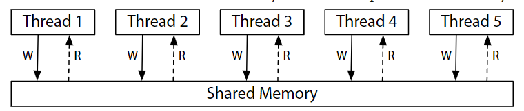
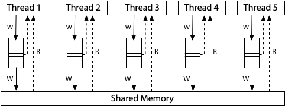
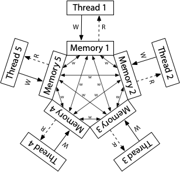

2021 年 06 月 09 日，Go 语言的父亲之一 Russ Cox 发布了 [三篇内存模型相关的推文](https://research.swtch.com/mm)，从硬件内存模型，逐步地引申到 Go 语言的内存模型。这里仅对这三篇文章进行翻译，这是第一篇，Hardware Memory Models.

---

## 背景介绍：单核的理想世界

很久以前，当每个人都在编写单线程程序时，使程序运行得更快的最有效方法之一就是坐视不管。下一代硬件和下一代编译器的优化将使程序的运行与以前完全一样，只是速度更快。 在这个童话般的时期，有一个简单的测试方法来判断一个优化是否有效：如果程序员不能分辨出一个有效程序的未优化和优化之后的区别（除了速度提升），那么这个优化就是有效的。也就是说，有效的优化并没有改变有效程序的行为。

几年前的某一天，单核处理器的性能增长速度逐渐变慢，为了让计算机的性能更加出色，处理器逐渐从纵向发展转向了横向发展：即以数量来代替单个处理器的质量。硬件工程师创造了拥有越来越多处理器的计算机，而操作系统以线程的抽象形式向程序员展示了硬件的并行性。但多核也为编程语言设计者、编译器设计者和程序员带来了重大的问题。

在单线程程序中，很多硬件级别以及编译器级别的优化是不可见的，也就是说这两者的优化不会改变程序的行为。但是在多线程程序中，这两者的优化可能会导致同一个程序产生不同的结果（改变了程序的行为）。如果一个有效的优化没有改变一个有效程序的行为，那么这些优化以及这个程序中的其中一个一定是无效的。到底是哪个无效呢？我们要怎么判断呢？

下面是一个类似 C 语言的简单程序例子。 在这个程序以及我们未来将要考虑的所有程序中，所有变量最初都被设置为 0。

```c
// Thread 1           // Thread 2
x = 1;                while(done == 0) { /* loop */ }
done = 1;             print(x);
```

如果线程 1 和线程 2 分别运行在自己的专用处理器上，并且都运行完了，这个程序能打印出 0 吗？

这得看情况。在不同的硬件、不同的编译器下可能会有不同的结果。如果是在 x86 机器上直接逐行翻译成汇编的话，这个两个线程的执行结果一直是 0。但如果在 ARM 或者 POWER 上直接逐行翻译成汇编，则有可能打印 0。除此之外，不论硬件是什么，标准的编译器优化也有可能使这个程序打印 0，或者进入一个死循环。

没有人喜欢不确定的结果。程序员需要明确地知道一个程序是否能在新的硬件和新的编译器下继续工作。硬件设计者和编译器开发者也需要明确地知道当执行一个给定的程序时，硬件和编译的代码可以如何精确地表达。因为最主要的问题是在多核环境下，内存数据里的可见性和一致性发生了改变，这个概念被称为内存一致性模型或者简称内存模型。

最初，内存模型的目标是定义为编写汇编代码的程序员提供哪些硬件保证，这并没有涉及到编译器。25 年前，人们开始尝试编写内存模型来定义 Java 或 C++ 等高级编程语言应该对使用该语言编写代码的程序员的有哪些保证。将编译器纳入考量范围后，使得定义合理的内存模型变得更加复杂。

这是关于硬件内存模型和编程语言内存模型的两篇文章中的第一篇。 我写这些文章的目的是为讨论我们可能想在 Go 的内存模型中进行的潜在变化建立背景。 但要了解 Go 的现状以及我们可能想要的方向，首先我们必须了解其他硬件内存模型和语言内存模型的现状，以及它们曾经走过的道路。

同样，这篇文章是关于硬件的。 让我们假设我们正在为一台多处理器计算机编写汇编语言。 为了写出正确的程序，程序员需要从计算机硬件上得到什么保证？四十多年来，计算机科学家们一直在寻找这个问题的良好答案。

## 顺序一致性 Sequential  Consistency

Leslie Lamport 在 1979 年发表的论文 [《How to Make a Multiprocessor Computer That Correctly  Executes Multiprocess Programs》](https://www.microsoft.com/en-us/research/publication/make-multiprocessor-computer-correctly-executes-multiprocess-programs/) 中提出了顺序一致性的概念。

> 设计和证明这种计算机的多进程算法正确性的惯常方法是假定满足以下条件：如果所有处理器的操作都按某种顺序执行，那么任何执行的结果都是一样的，而且每个处理器的操作都按其程序指定的顺序出现在这个顺序中。满足这一条件的多处理器将被称为顺序一致的。

今天我们谈论的不仅仅是计算机硬件，还有保证顺序一致性的编程语言，当一个程序的唯一可能的执行对应于某种线程操作的交错顺序执行。 顺序一致性通常被认为是理想的模型，是程序员最自然的工作方式。它让你假设程序按照它们在页面上出现的顺序执行，各个线程的执行只是按照某种顺序交错进行，但没有其他的后置排列。

人们可以合理地质疑顺序一致性是否应该是理想的模型，但这超出了本帖的范围。我只想说，考虑所有可能的线程交织，在今天和 1979 年一样，仍然是 "设计和证明多进程算法正确性的惯用方法。" 在这四十年间，没有任何东西可以取代它。

上面提到了，这个程序是否能够打印 0。

```c
// Thread 1           // Thread 2
x = 1;                while(done == 0) { /* loop */ }
done = 1;             print(x);
```

为了使程序更容易分析，让我们去掉循环和打印，并探索读取共享变量的可能结果。

```c
Litmus Test: Message Passing
Can this program see r1 = 1, r2 = 0?

// Thread 1           // Thread 2
x = 1                 r1 = y
y = 1                 r2 = x
```

我们假设每个例子都是以所有的共享变量设置为零开始的。 由于我们试图确定硬件被允许做什么，我们假设每个线程都在自己的专用处理器上执行，并且没有编译器来重新排列线程中发生的事情：列表中的指令是处理器执行的指令。 rN 表示一个线程本地寄存器，而不是一个共享变量，我们问的是在执行结束时线程本地寄存器是否有可能存在我们提出的状态。

这种关于示例程序执行结果的问题称为 alitmus 测试。因为它有一个二元的答案——这个结果可能还是不可能？allitmus 测试给了我们一个清晰的方法来区分内存模型：如果一个模型允许特定的执行结果而另一个模型不允许，那么这两个模型显然是不同的。不幸的是，正如我们稍后将看到的，特定模型对特定测试的回答通常令人惊讶。

如果这个 allitmus 测试的执行是顺序一致的，那么只有六个可能的结果：



因为两个线程交错执行的结果是没有 `r1 = 1, r2 = 0` 的，因此在顺序一致的硬件上，这个程序的运行结果不会看到 `r1 = 1, r2 = 0` 。

顺序一致性的一个很好的心理模型是想象所有处理器直接连接到同一个共享内存，它可以一次为 ** 一个线程的读或写请求 ** 提供服务。不涉及缓存，因此每次处理器需要读取或写入内存时，该请求都会转到共享内存。一次使用一次的共享内存在所有内存访问的执行上强加了一个顺序顺序：顺序一致性。



(此处的三个内存模型硬件图改编自 Maranget al., "A[ Tutorial Introduction to ARM and POWER RelaxedMemory Models](https://www.cl.cam.ac.uk/~pes20/ppc-supplemental/test7.pdf).)

这张图是一个顺序一致的机器的模型，而不是建立一个机器的唯一方法。事实上，使用多个共享内存模块和缓存来帮助预测内存获取的结果，建立一个顺序一致的机器是可能的，但顺序一致意味着该机器与这个模型的行为没有区别。 如果我们只是想了解顺序一致的执行意味着什么，我们可以忽略所有这些可能的执行复杂问题，而考虑这一个模型

对我们程序员来说，不幸的是，放弃严格的顺序一致性可以让硬件更快地执行程序，所以所有现代硬件都以各种方式偏离了顺序一致性。 准确定义具体的硬件偏离的方式是相当困难的。本文以当今广泛使用的硬件中存在的两种内存模型为例：X86 的内存模型以及 ARM 和 POWER 处理器系列的内存模型。

## x86 Total Store Order(x86-TSO)

现代 x86 系统的内存模型对应于这个硬件图：



所有的处理器仍然连接到一个共享内存，但每个处理器都在本地写队列中排队写到该内存。 处理器继续执行新的指令，同时写到共享内存上。一个处理器上的内存读取在查阅主内存之前会查询本地写队列，但它 ** 不能 ** 看到其他处理器的写队列。 这一点非常重要：所有的处理器都同意写（存储）到达共享内存的（全部）顺序，这就是该模型的名称：total store order，或 TSO。在写到达共享内存的那一刻，** 任何处理器 ** 上的 ** 未来读 ** 都会看到它并使用这个值（直到它被后来的写覆盖，或者被来自另一个处理器的缓冲写覆盖）。

写入队列是一个标准的先入先出队列：内存的写入是按照处理器执行的顺序应用到共享内存的。 因为写队列保留了写的顺序，而且因为其他处理器立即看到了对共享内存的写，所以我们之前考虑的 message passing 测试的结果与之前一样： `r1=1` ， `r2=0` 仍然是不可能的。

```c
Litmus Test: Message Passing
Can this program see r1 = 1, r2 = 0?

// Thread 1           // Thread 2
x = 1                 r1 = y
y = 1                 r2 = x
On sequentially consistent hardware: no.
On x86 (or other TSO): no.
```

写入队列保证了线程 1 在写 y 之前将 x 写入内存，而全系统对内存写入顺序的一致意见（全部存储顺序）保证了线程 2 在知道 y 的新值之前就知道了 x 的新值。 因此， r1=y 不可能在看到新值的同时，r2=x 看到了 x 的旧值。 存储顺序在这里至关重要：线程 1 先写 x 再写 y ，所以线程 2 不可能先看到对 y 的写入操作，后看到对 x 的写入操作。

在这种情况下，顺序一致性模型和 TSO 模型是一致的，但它们对其他测试的结果却不一致。 例如，这是区分这两种模型的常用例子:

```c
Litmus Test: Write Queue (also called Store Buffer)
Can this program see r1 = 0, r2 = 0?

// Thread 1           // Thread 2
x = 1                 y = 1
r1 = y                r2 = x
On sequentially consistent hardware: no.
On x86 (or other TSO): yes!
```

在任何顺序一致的执行中，x=1 或者 y=1 必须先发生，然后其他线程的读必须观察到它，所以 r1=0，r2=0 是不可能的。 但在一个 TSO 系统中，可能会发生线程 1 和线程 2 同时排队等待他们的写操作，然后在任何一个写操作进入内存之前从内存中读取，所以这两个读操作都看到了零。（一个处理器无法看到其他处理器的写入队列）

这个例子可能会让人觉得很假，但在著名的同步算法中，比如 [Dekker 的算法](https://en.wikipedia.org/wiki/Dekker%27s_algorithm)或 [Peterson 的算法](https://en.wikipedia.org/wiki/Peterson%27s_algorithm)，以及一些特别的方案中，使用两个同步变量的情况确实存在。 如果一个线程没有看到来自另一个线程的所有写操作，它们就会崩溃。

为了修复那些依赖于更强的内存排序的算法，非顺序一致的硬件提供了明确的指令，称为内存屏障（或 fences），可以用来控制排序。我们可以添加一个内存屏障，以确保每个线程在开始读取之前，都会将之前的写内容刷新到内存中。

```c
// Thread 1           // Thread 2
x = 1                 y = 1
barrier               barrier
r1 = y                r2 = x
```

加上屏障后，r1=0，r2=0 又是不可能的了，Dekker 或 Peterson 的算法就能正确工作了。 内存屏障有很多种；细节因系统而异，超出了本篇文章的范围。重点是，内存屏障的存在给了程序员或语言实现者一种方法，在程序的关键时刻强制执行顺序一致的行为。

最后一个例子，来说明为什么这个模型被称为 total store order。在这个模型中，有本地的写队列，但在读取路径上没有缓存。 一旦写操作到达主内存，所有的处理器不仅同意该值在那里，而且同意它 ** 相对于来自其他处理器的写操作的到达时间 **。

考虑下面的测试：

```c
Litmus Test: Independent Reads of Independent Writes (IRIW)
Can this program see r1 = 1, r2 = 0, r3 = 1, r4 = 0?
(Can Threads 3 and 4 see x and y change in different orders?)

// Thread 1    // Thread 2    // Thread 3    // Thread 4
x = 1          y = 1          r1 = x         r3 = y
                              r2 = y         r4 = x
On sequentially consistent hardware: no.
On x86 (or other TSO): no.
```

如果线程 3 在 y 之前看到了 x 的变化，线程 4 能在 x 之前看到 y 的变化吗？对于 X86 和其他 TSO 机器来说，答案是否定的：对主内存的所有存储（写）有一个总的顺序，所有处理器都同意这个顺序，但要注意的是，每个处理器在到达主内存之前就知道自己的写入情况。

## x86-TSO 之路

x86-TSO 模型似乎相当清晰，但在这条道路上充满了障碍和错误。在 20 世纪 90 年代，第一批 x86 多处理器的手册对硬件提供的内存模型几乎只字未提。

作为问题的一个例子，Plan 9 是最早在 x86 上运行的真正的多处理器操作系统之一（没有全局内核锁）。 在 1997 年向多处理器 Pentium Pro 移植的过程中，开发人员在对于写队列的 litmus test 中遇到了意想不到的行为，一段微妙的同步代码假设 r1=0，r2=0 是不可能的，但它却发生了。更糟的是，英特尔的手册对内存模型的细节含糊其辞。

对于邮件中的建议 “与其相信硬件设计者会做我们期望的事情，不如对锁采取保守的态度。” Plan 9 的开发者之一很好地[解释了这个问题](https://web.archive.org/web/20091124045026/http://9fans.net/archive/1997/04/76)：

> 我当然同意。我们将在多核处理器中遇到更宽松的排序 (ordering)。  问题是，硬件设计人员认为什么是保守的？  对我来说，在锁定部分的开头和结尾强制进行加锁似乎是相当保守的，但我显然不够有想象力。专业手册在描述高速缓存和保持其连贯性的细节方面做得非常好，但对执行顺序或读时序的细节却不屑一顾。事实上，我们没有办法知道我们是否足够保守。

在讨论中，英特尔的一位架构师对内存模型进行了非正式的解释，指出在理论上，486 和 Pen-tium 的多处理器系统都可以产生 r1=0, r2=0 的结果，而 Pen-tium Pro 只是拥有更大的流水线和写队列，所以会更频繁地暴露出这种行为。

这位 Intel 架构师同时也指出：

> 广义上讲，这意味着系统中任何一个处理器所产生的事件的排序，在其他处理器的观察下，总是相同的。然而，不同的观察者被允许对来自两个或更多处理器的事件的交错执行产生分歧。未来的英特尔处理器将实现相同的内存排序模型。

声称 “允许不同的观察者对来自两个或更多处理器的事件的交织产生分歧” 是在说 IRIW litmus test 的答案在 x86 上可以回答 "是"，尽管在上一节我们看到 x86 回答 "不是"。 这怎么可能呢？

答案似乎是，英特尔处理器实际上从未对这一测试做出过回答，但当时英特尔的架构师不愿对未来的处理器做出任何保证。架构手册中的少量文字几乎没有做出任何保证，这使得编程变得非常困难。

Plan 9 的讨论并不是一个孤立的事件。 从 [1999 年 11 月开始](https://lkml.org/lkml/1999/11/20/76)，Linux 内核的开发者们在他们的邮件列表上花费了一百多条信息，讨论 Intel 处理器导致类似的问题。

在随后的十年里，越来越多的人遇到了类似困难，英特尔的一些架构师决定为当前和未来的处理器定义一组处理器应该具备的能力（接口）。第一个成果是 2007 年 8 月发表的 “[Intel 64 Architecture Memory OrderingWhite Paper](http://www.cs.cmu.edu/~410-f10/doc/Intel_Reordering_318147.pdf)”，其目的是 "让软件编写者清晰理解不同内存访问指令序列可能产生的结果"。AMD 在今年晚些时候的 [AMD64 架构程序员手册修订版 3.14](https://courses.cs.washington.edu/courses/cse351/12wi/supp-docs/AMD%20Vol%201.pdf) 中发表了类似的描述。 这些描述是基于一个叫做 "total lock order + causal consistency"（TLO+CC）的模型，要求比 TSO 更弱。 在公开谈话中，英特尔的架构师说，TLO+CC 是 "as strong as required but no stronger"。值得注意的是，他们的模型为 x86 处理器保留了对 IRIW litmus test 的回答 "是" 的权利。但是，[内存屏障的定义并不强大](http://web.archive.org/web/20080512021617/http://blogs.sun.com/dave/entry/java_memory_model_concerns_on)，即使在每条指令前都有一个屏障，但仍不足以重建顺序一致的内存语义。更糟糕的是，研究人员观察到英特尔 x86 硬件违反了 TLO+CC 模型的行为，比如：

```c
Litmus Test: n6 (Paul Loewenstein)
Can this program end with r1 = 1, r2 = 0, x = 1?

// Thread 1    // Thread 2
x = 1          y = 1
r1 = x         x = 2
r2 = y

On sequentially consistent hardware: no.
On x86 TLO+CC model (2007): no.
On actual x86 hardware: yes!
On x86 TSO model: yes! (Example from x86-TSO paper.)
```

2008 年晚些时候对英特尔和 AMD 规格的修订保证了对 IRIW 用例的 "no"，并加强了内存屏障，但仍允许出现意外的行为，并且这些行为在任何合理的硬件上似乎都不可能出现，比如：

```c
Litmus Test: n5
Can this program end with r1 = 2, r2 = 1?

// Thread 1    // Thread 2
x = 1          x = 2
r1 = x         r2 = x

On sequentially consistent hardware: no.
On x86 specification (2008): yes!
On actual x86 hardware: no.
On x86 TSO model: no. (Example from x86-TSO paper.)
```

为了解决这些问题，Owens 等人提出了 [x86-TSO 模型](https://www.cl.cam.ac.uk/~pes20/weakmemory/x86tso-paper.tphols.pdf)，基于早期的 [SPARCv8 TSO](https://research.swtch.com/sparcv8.pdf) 模型。当时他们声称："据我们所知，x86-TSO 是健全的，足够强大，可以在上面编程，并且大致符合供应商的意图。" 几个月后，英特尔和 AMD 发布了新的手册，全面采用了这种模式。

看起来所有的英特尔处理器确实从一开始就实现了 x86-TSO，尽管英特尔花了十年时间才决定致力于此。回过头来看，很明显，英特尔和 AMD 的架构师们正在努力解决如何编写一个内存模型，为未来的处理器优化留下空间，同时还能为编译器编写者和汇编语言程序员提供有用的保证。"As strong as required but no stronger" 是一个很难达到的平衡点。

## ARM/POWER Relaxed Memory Model

现在让我们来看看更加宽松的内存模型，即 ARM 和 POWER 处理器上的模型。在实现层面上，这两个系统在很多方面都不一样，但保证内存一致性的模型原来大致相似，而且比 x86-TSO 或甚至 x86-TLO+CC 要弱一些。

ARM 和 POWER 系统的概念模型是，每个处理器从其自身的完整内存副本中读取和写入，并且每个写入都独立传播到其他处理器，在写入传播时允许重新排序。(译者注：这意味着某个处理器的写入顺序对于其他的处理器来说是乱序的)



这里没有全序排列 (total store order)。每个处理器也被允许推迟读取，直到它需要这个结果，这意味着 ** 读取可以被推迟到后来的写入之后 **。在这个宽松的模型中，到目前为止，我们所看到的每一个测试的答案都是 "是的，这真的可以发生"。

对于最开始的 message passing litmus test，单个处理器对写的重新排序意味着线程 1 的写可能不会被其他线程以相同的顺序观察到。

```c
Litmus Test: Message Passing
Can this program see r1 = 1, r2 = 0?

// Thread 1           // Thread 2
x = 1                 r1 = y
y = 1                 r2 = x

On sequentially consistent hardware: no.
On x86 (or other TSO): no.
On ARM/POWER: yes!
```

在 ARM/POWER 模型中，我们可以认为线程 1 和线程 2 都有自己独立的内存副本，写操作在内存之间以任何顺序传播。如果线程 1 的内存在发送 x 的更新之前将 y 的更新发送给线程 2，如果线程 2 在这两个更新之间执行，它确实会看到结果 r1=1，r2=0。

这一结果表明，ARM/POWER 内存模型比 TSO 弱：它对硬件的要求更少。ARM/POWER 模型仍然允许 TSO 所做的各种重新排序。

```c
Litmus Test: Store Buffering
Can this program see r1 = 0, r2 = 0?

// Thread 1           // Thread 2
x = 1                 y = 1
r1 = y                r2 = x
On sequentially consistent hardware: no.
On x86 (or other TSO): yes!
On ARM/POWER: yes!
```

在 ARM/POWER 上，对 x 和 y 的写入可能会写入本地内存，但当其他线程想要读取时，这一写入结果尚未被传播到其他的线程本地内存中。

下面的测试显示了这对于有 total store order 的 x86 机器意味着什么。

```c
Litmus Test: Independent Reads of Independent Writes (IRIW)
Can this program see r1 = 1, r2 = 0, r3 = 1, r4 = 0?
(Can Threads 3 and 4 see x and y change in different orders?)

// Thread 1    // Thread 2    // Thread 3    // Thread 4
x = 1          y = 1          r1 = x         r3 = y
                              r2 = y         r4 = x

On sequentially consistent hardware: no.
On x86 (or other TSO): no.
On ARM/POWER: yes!
```

在 ARM/POWER 上，不同的线程可能以不同的顺序了解不同的写入。它们不能保证在到达主内存的总写入顺序上达成一致，因此线程 3 可能看到 x 在 y 之前发生变化，而线程 4 则看到 y 在 x 之前发生变化。

另一个例子是，ARM/POWER 系统对内存的读取（加载）有明显的缓冲或重新排序，正如下面的测试所显示的那样。

```c
Litmus Test: Load Buffering
Can this program see r1 = 1, r2 = 1?
(Can each thread's read happen after the other thread's write?)

// Thread 1    // Thread 2
r1 = x         r2 = y
y = 1          x = 1

On sequentially consistent hardware: no.
On x86 (or other TSO): no.
On ARM/POWER: yes!
```

任何顺序一致的交错执行必须从线程 1 的 r1=x 或线程 2 的 r2=y 开始。最开始的读必须看到一个 0 ，使得结果 r1=1，r2=1 不可能出现。然而，在 ARM/POWER 内存模型中，允许处理器将读延迟到指令流中稍后的写之后，因此 y = 1 和 x = 1 在两个读之前执行。

尽管 ARM 和 POWER 内存模型都允许出现这种结果，但 Maranget 等人[报告说（在 2012 年）](https://www.cl.cam.ac.uk/~pes20/ppc-supplemental/test7.pdf)，他们只能在 ARM 系统上凭经验重现这种结果，在 POWER 系统上从未出现过。在这里，模型和现实之间的分歧开始发挥作用，就像我们在研究 Intel x86 时一样：实现更强约束的模型的硬件鼓励依赖更强约束的行为，这意味着未来更弱约束的硬件将破坏原有 的程序，无论这个程序是否有效。

像在 TSO 系统上一样，ARM 和 POWER 也有内存屏障，我们可以在上面的例子中插入内存屏障来强制执行顺序一致的行为。但明显的问题是，不带有内存屏障的 ARM/POWER 是否排除了任何行为？任何测试的答案都可以是 "no" 吗？当我们专注于一个单一的内存位置时，可以。

这里有一个测试，即使在 ARM 和 POWER 上也不可能发生的事情。

```c
Litmus Test: Coherence
Can this program see r1 = 1, r2 = 2, r3 = 2, r4 = 1?
(Can Thread 3 see x = 1 before x = 2 while Thread 4 sees the reverse?)

// Thread 1    // Thread 2    // Thread 3    // Thread 4
x = 1          x = 2          r1 = x         r3 = x
                              r2 = x         r4 = x

On sequentially consistent hardware: no.
On x86 (or other TSO): no.
On ARM/POWER: no.
```

这个测试和之前的一样，但现在两个线程都在向一个单一的变量 x 写，而不是两个不同的变量 x 和 y。线程 1 和 2 向 x 写冲突的值 1 和 2，而线程 3 和线程 4 都读 x 两次。如果线程 3 看到 x=1 被 x=2 覆盖，线程 4 能看到相反的情况吗？

答案是否定的，即使在 ARM/POWER 上也是如此：系统中的线程必须同意对单个内存位置进行写入的总顺序。也就是说，线程必须同意哪些写操作会覆盖其他写操作。这一属性被称为 ** 一致性 **。如果没有一致性属性，处理器要么对内存的最终结果意见不一，要么察觉到内存位置从一个值到另一个值再回到第一个值的翻转。对这样的系统进行编程将是非常困难的。

我特意忽略了 ARM 和 POWER 弱存储器模型中的很多细微之处。要了解更多细节，请参见 [Peter Sewell 关于该主题的任何论文](https://www.cl.cam.ac.uk/~pes20/papers/topics.html#Power_and_ARM)。另外，ARMv8 通 过使其成为 "multicopy atomic" 来[加强内存模型](https://www.cl.cam.ac.uk/~pes20/armv8-mca/armv8-mca-draft.pdf)，但我不会在这里花时间解释这到底意味着什么。

还有两个重要的点需要注意。
首先，这里有大量的微妙之处，是由非常执着、非常聪明的人进行了超过十年的学术研究。我并不声称自己能理解其中的任何地方。这不是我们应该希望向普通程序员解释的东西，也不是我们在调试普通程序时可以希望保持的东西。
第二，允许的东西和观察到的东西之间的差距使得未来出现难以预料的结果。如果目前的硬件没有表现出全部允许的行为，特别是当我们很难推理出什么是允许的行为时，那么不可避免的是，编写的程序会意外地依赖于实际硬件的更多限制行为。如果一个新的芯片的行为限制较少，那么破坏你的程序的新行为在技术上是被硬件内存模型所允许的 -- 也就是说，这个错误在技术上是你的错误 -- 这一事实并不令人感到安慰。这不是编写程序的方法。

## Weak Ordering and Data-Race-Free Sequential Consistency

现在我希望你相信，硬件细节是复杂而微妙的，不是你每次写程序时都想解决的问题。相反，找出 "如果你遵循这些简单的规则，你的程序只会像通过一些顺序一致的交织一样产生结果" 这样的捷径会有帮助。(我们仍在讨论硬件，所以我们仍在讨论各个汇编指令的交错。)

Sarita Adve 和 Mark Hill 在 1990 年的论文[《弱排序 -- 一个新的定义》](http://citeseerx.ist.psu.edu/viewdoc/summary?doi=10.1.1.42.5567)中正是提出了这种方法。他们对 "弱排序" 的定义如下。

> 让同步模型成为一组关于内存访问的约束条件，规定如何以及何时需要进行同步。当且仅当硬件对所有遵守同步模型的软件来说是顺序一致的，那么硬件对同步模型来说就是弱有序的。

虽然他们的论文是讨论当时的硬件设计（而不是 x86、ARM 和 POWER），但如果将这个讨论提升到特定设计之上，则该论文至今仍具有现实意义。

我以前说过，"有效的优化不会改变有效程序的行为"。规则定义了有效的含义，然后任何硬件优化都必须保持这些程序在顺序一致的机器上的工作状态。当然，有趣的细节是规则本身。即定义什么样的程序是有效的。

Adve 和 Hill 提出了一种同步模型，他们称之为 data-race-free（DRF）。这个模型假设硬件的内存同步操作与普通内存的读写分开。普通内存的读写可以在同步操作之间重新排序，但它们不能跨越同步操作进行移动。(也就是说，同步操作也是重新排序的屏障）。) 如果在所有理想化的顺序一致的执行中，不同线程对同一位置的任何两个普通内存访问要么都是读，要么被同步操作分开，迫使一个在另一个之前发生，那么这个程序被称为 data-race-free。（译者注：即要么全是读，要么读写、写写是分离的）

让我们看一些取自 Adve 和 Hill 论文的示例。这是一个单线程，它执行对变量 x 的写入，然后是对同一变量的读取。


垂直箭头标志着单线程内的执行顺序：先写后读。在这个程序中不存在竞争，因为一切都在单线程中。

相比之下，这个双线程程序中存在竞争：


在这里，线程 2 在没有与线程 1 协调的情况下写到了 x。线程 2 的写与线程 1 的写和读都有竞争。如果线程 2 是在读 x 而不是写它，程序将只有一个竞争，即线程 1 的写和线程 2 的读之间。每场竞争至少涉及一个写：两个没有协调的读不会相互竞争。

为了避免竞争，我们必须增加同步操作，这些操作会强制共享一个同步变量的不同线程的操作顺序。如果同步 S(a)（对变量 a 进行同步，用虚线箭头标记）迫使线程 2 的写操作在线程 1 完成后发生，那么竞争就被消除了。


现在线程 2 的写不能与线程 1 的操作同时发生。如果线程 2 只是在读，我们只需要与线程 1 的写同步。这两个读仍然可以同时进行。


线程可以通过一连串的同步来排序，甚至使用中间线程。这个程序没有竞争。


另一方面，使用同步变量本身并不能消除竞争，因为有可能会错误地使用它们。这个程序有一个竞争。

线程 2 的读与其他线程的写是正确同步的 -- 它肯定发生在两者之后 -- 但这两个写本身并不同步。这个程序不是无竞争的。

Adve 和 Hill 把弱排序说成是 "软件和硬件之间的契约"，具体来说，如果软件避免了数据竞赛，那么硬件的行为就好像是顺序一致的，这比我们在前面几节中研究的模型更容易推理。但是，硬件如何才能满足它的契约的一端？

Adve 和 Hill 给出了一个证明，即硬件如果 "通过 Data-Race-Free 进行了弱排序"，这意味着它执行无数据竞争的程序就像通过了顺序一致的排序一样，只要它满足一组特定的最低要求。我不打算讨论这些细节，但重点是，在 Adve 和 Hill 的论文之后，硬件设计者有了一个由证明支持的方法：做这些事情，你可以断言你的硬件将对无数据竞争的程序显示出顺序一致的性质。事实上，大多数宽松的硬件确实是这样表现的，并且一直如此，假设同步操作有适当的实现。Adve 和 Hill 最初关注的是 VAX ，但当然 X86、ARM 和 POWER 也能满足这些约束。这种系统保证无数据竞争的程序程序出现顺序一致性的想法通常被缩写为 DRF-SC。

DRF-SC 标志着硬件内存模型的一个转折点，为硬件设计者和软件作者，至少是那些用汇编语言编写软件的人提供了一个明确的策略。正如我们在下一篇文章中所看到的，高级编程语言的内存模型问题并没有那么整齐划一的答案。

本系列的下一篇文章是关于编程语言的内存模型。

## 鸣谢

这一系列的文章极大地受益于与一长串工程师的讨论和反馈，我很幸运能在谷歌工作。我对他们表示感谢。我对任何错误或不受欢迎的意见承担全部责任。

下一篇：[编程语言内存模型](../plmm)