## Latches Overview

> Latch 和 Lock 的区别是什么？

Lock 使数据库的逻辑内容，比如一些行、表等高抽象的数据在被一个事务访问、更新、删除时，不会被其他的事务干扰。Lock 会在整个事务期间被持有，并且需要有回滚的能力。

而一个事务可以拥有多个线程，来访问同一行数据。从低层次的角度讲，这也需要一个“锁”来保护数据的并发读写，这个“锁”在操作系统里被称为 Lock，而在数据库里被称为 Latch，目的是为了与上一段提到的 Lock 进行区分。

因此 Latch 的作用是保护 DBMS 的内部数据结构在被多个线程读写时有正确的结果。Latch 在读写操作持续期间被持有，且不需要有回滚的能力。

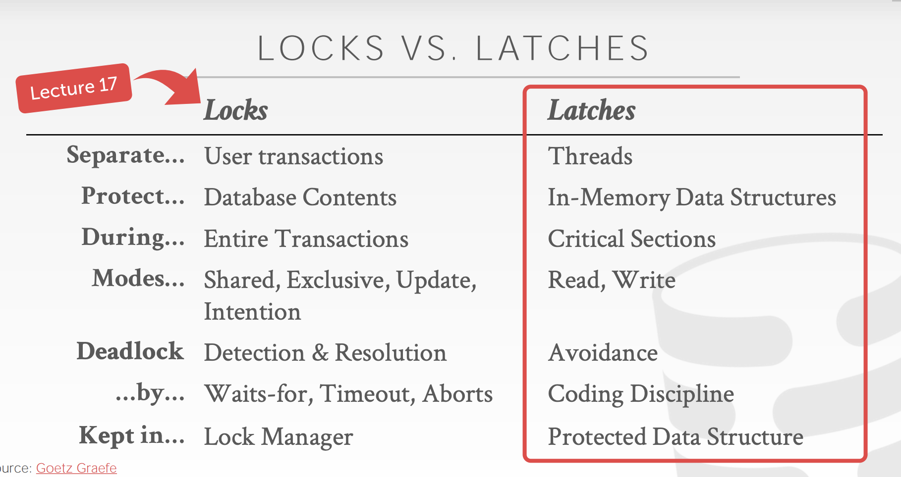

### Latch 实现

#### Blocking OS Mutex

latch 最简单的实现方式就是使用操作系统提供的 mutex，例如在 c++中：

```c++
std::mutex m;
...
m.lock();
// Do something special
m.unlock();
```

但是缺陷是不可扩展（每个 lock 和 unlock 操作大概需要 25ns）

#### Test-and-Set Spin Latch (TAS)

效率非常高，因为现代 CPU 支持只使用一条指令来加锁和解锁，从硬件上保证了单一原子性操作。

 ```
 std::atomic_flag latch;
 ...
 while(latch.test_and_set(...)) {
 	// Retry? Yield? Abort?
 }
 ```

缺陷同样是不可扩展，对 cache 不友好。

```c++
lock = 0 //shared state
while(test_and_set(lock)){ //try lock
       //do nothing   
}
// 临界区代码
lock = 0   //release 
```

当第一个线程执行这段代码时，TAS 指令会立即把 lock 设置为 1，并返回 0 ，线程退出 while 循环进入临界区。

如果另一个线程尝试进入临界区，TAS 会把 lock 设置为 1，但是也会返回 1（由第一个线程的 TAS 指令设置为 1).

此时第二个线程会一直 while 循环（忙等待），直到第一个线程退出临界区代码，执行了 lock=0，即释放了锁。

这种通过 while-loop 等待获取锁的实现称为自旋锁 (spin lock)。

#### Reader-Writer Latch

- 允许多读者同时读数据。
- 但需要维护读写队列，防止饥饿现象。
- 可以在自旋锁的基础上实现读写锁。

## Hash Table Latching

哈希表的加锁方式比较简单，因为哈希表访问数据的方式是相对固定的，即通过哈希函数找到对应的 slot 后，全都是从前往后地顺序扫描 slot 里存的数据。

### Page Latches

- 每一个页面都有自己的读写锁来保护页面中的所有内容
- 线程需要在访问页面之前获取读锁或者写锁

### Slot Latches

- 每个 slot 都有自己的锁
- 可以使用简单的锁来减少元数据消耗和运算开销

## B+ Tree Latching

为了提高 B+树的并发性，我们需要防止以下两个问题：

- 多个线程想要同时修改 node 的数据。
- 一个线程经过了树中的某些节点，而另一个线程正在分裂、合并这个线程经过的节点。

### LATCH CRABBING/COUPLING

螃蟹算法，蟹型算法。

一个基础的想法是：

1. 获取父亲的 Latch
2. 获取孩子的 Latch
3. 如果确认父亲是“安全的”，则可以释放父亲的锁

这个想法可以避免上述两个问题。一个**”安全的“**锁意味着这个节点在更新时不会**被分裂**或者**被合并**。因为更新有插入、删除两种操作，所以在**”安全的“**也意味着：

- 插入时，节点不会满，不会触发分裂
- 删除时，节点至少有一半的数据，不会触发合并

#### 查找操作

从根节点开始，向下查找节点，重复以下步骤：

- 获取孩子节点的读锁
- 释放父亲的读锁

#### 插入、删除操作

从根节点开始，向下找目标节点。因为涉及修改操作，因此需要获取写锁，一旦一个孩子节点被加锁了，检查这个节点是否是安全的

- 如果是安全的，则释放所有祖先节点中的锁

> 为什么叫 Crabbing? 因为加锁和解锁是像螃蟹一样，前脚伸出去，后脚才能收回来（其实我觉得更像一条虫）

### EXAMPLE

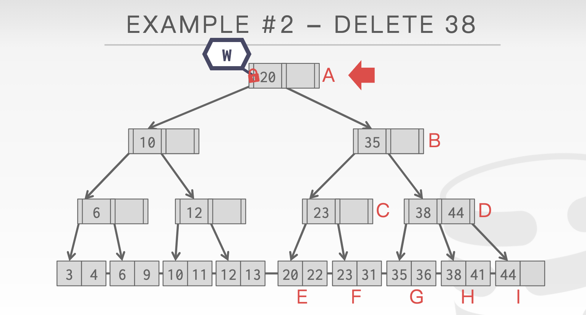

如上图所示，我们要删除 38，操作步骤为：

1. 获取 A 的写锁
2. 获取 B 的写锁，因为是删除操作，而 B 恰好是半满的，如果删除 38 的操作导致 B 的 35 被删的话，可能会使得 B 发生合并操作，因此 B 现在还不是安全的
3. 获取 D 的写锁，D 是全满的，就算 D 中的 38 和 44 被删了任意一个，他仍然没有与 C 进行合并的可能，因此 D 是安全的。此时可以释放 D 的祖先的锁

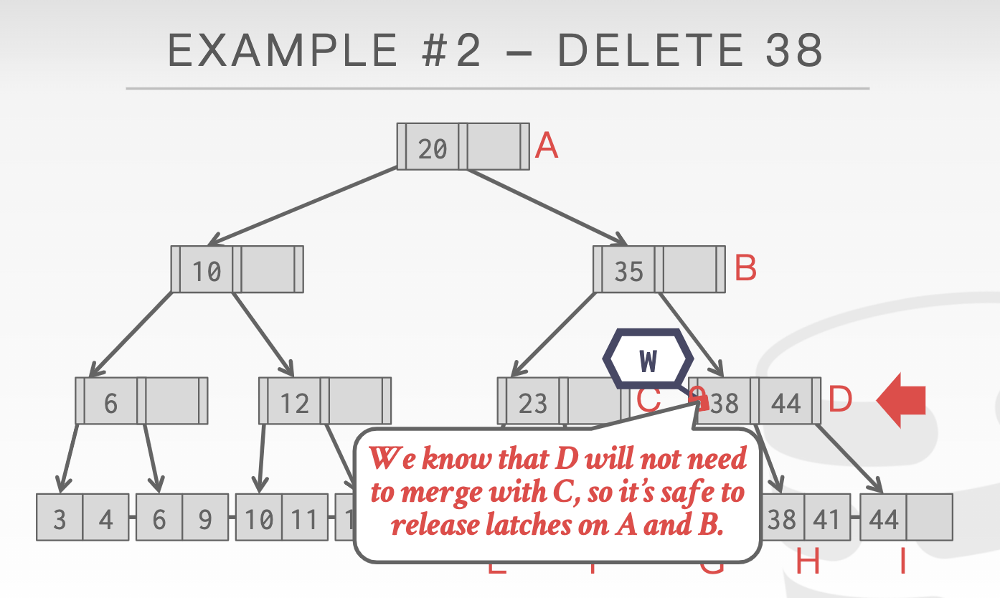

同理，当到达 H 时，H 也是安全的，因此 D 的锁也被释放

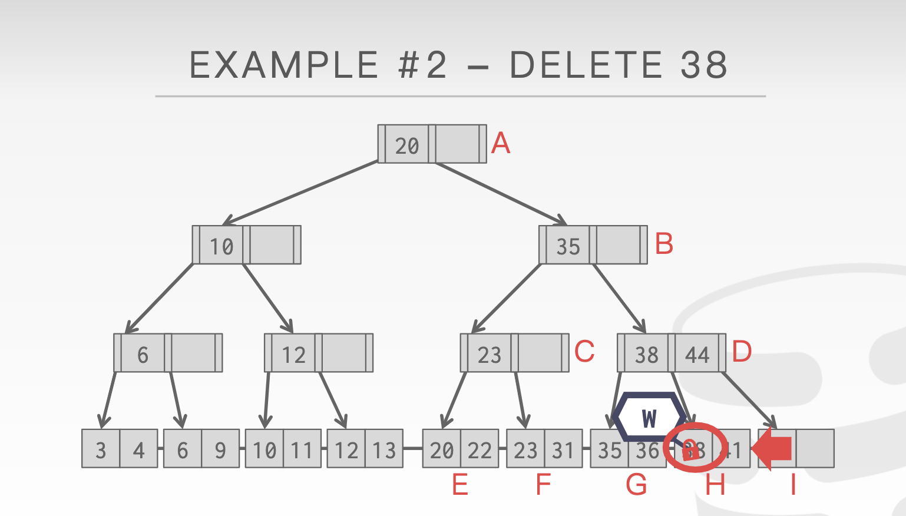

---

事实上，锁的释放顺序是没有硬性规定的，也就是说当 D 发现他祖先的锁可以被释放时，可以先释放 A 再释放 B，也可以先释放 B 再释放 A。因为 A 的锁在自己手上，A 的孩子节点的访问者就一定只有自己，所以不会出现问题。**但通常会倾向于先释放高层的锁，因为高层拥有的孩子节点更多，从而使得出现锁争用的可能性会更大。**

### 优化

在上述过程中，一个瓶颈就是在对 B+树叶子节点有修改时加的锁都是写锁，写锁是互斥的，导致并发程度不高。而在实际生产环境中，B+树发生分裂或者合并的概率是比较小的，比如一个节点大小有 16KB，相当一部分的修改操作是不会有分裂、合并操作的。

**Concurrency of Operations on B-Trees **这篇论文提出了一个最优假设：假设大部分线程的操作都不需要使叶子结点发生分裂或合并操作。因此，对于大部分操作，可以对其**路径上的节点加读锁，对叶子结点加写锁**来提高并发程度。如果叶子节点没有触发分裂或合并，则证明假设是正确的，不需要进行另外的操作。

而对于真正触发分裂、合并的操作序列，则重新执行一遍该操作，对其**路径上的节点加写锁，对叶子结点加写锁**来保证获得正确的执行结果。

## Leaf Node Scans

上述过程中，所有的操作都是自上而下的，即必须获得上层的锁，才能去操作下层的数据。但是如果是叶子结点的横向访问呢？例如访问完 G 后，去访问 H。这样的操作就可能会导致死锁。

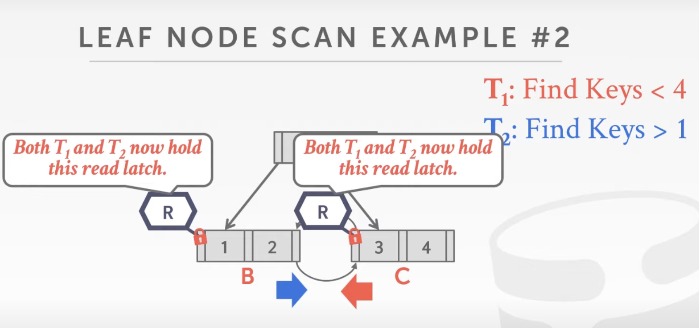

例如一个找小于 4 的 key，一个找大于 1 的 key。而横向的跨越需要先持有自己原来的锁，例如 T2 操作，需要先持有 B 的锁，再去获得 C 的锁，当获得 C 的锁后，再释放 B 锁。该图显示的是两个查询操作，使用的锁都是读锁，因此不会出现死锁。

但是如果是一读一写，或者是两个写锁，则会导致了互相等待，产生死锁。

遗憾的是 Latch 不支持检测或者预防死锁，唯一能解决死锁问题的方法是使用良好的编程原则，叶子结点获取 latch 的协议必须支持'no-wait'。

一个合理地解决方式是，在一段时间内没有获得锁的话，这个线程就自杀，然后重新执行。因为这个线程本身没有全局的视角，不知道对方线程是在获取自己持有的锁，还是单纯因为执行慢。

## Delayed Parent Updates

在** Concurrency of Operations on B-Trees **提出的假设中，如果叶子结点最后触发了分裂或者合并，则需要重新执行这条命令，并且加上写锁。Delayed Parent Updates 的观点是可以延迟去更新祖先，等到后面的命令重新经过这条路径时顺带更新数据。

假设现在要插入 25

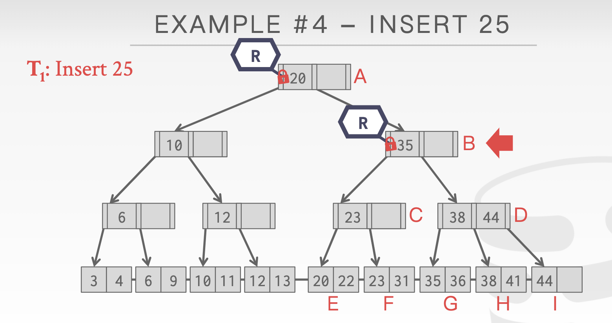

到叶子节点时发现触发了分裂

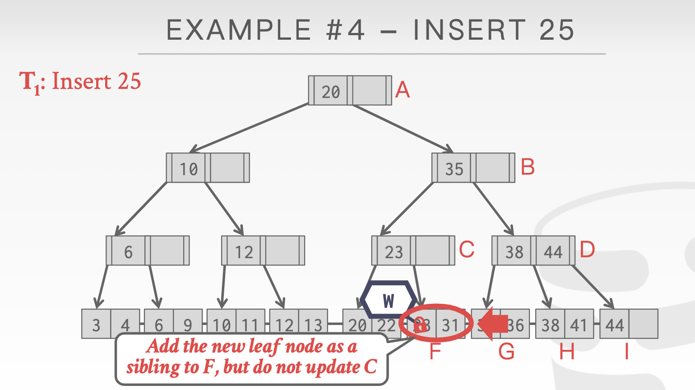

按道理此时应该重新以写锁执行该指令，但是 Delayed Parent Updates 不这样做，而是在 F 点边上增加一个兄弟节点，但不去更新 C。这样就不需要担心 C 节点的锁争用问题。

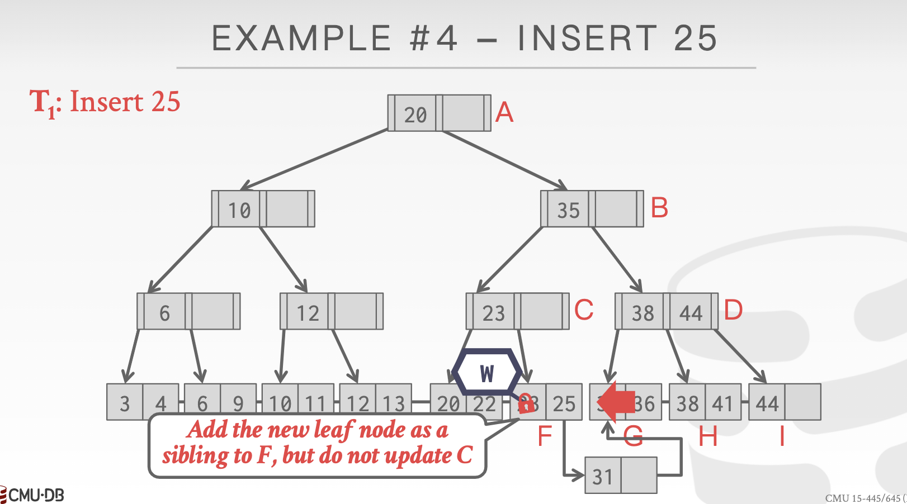

然后在整个表头上加上”应该在 C 里添加 31“这个信息，提醒下个经过这个路径的命令要注意。

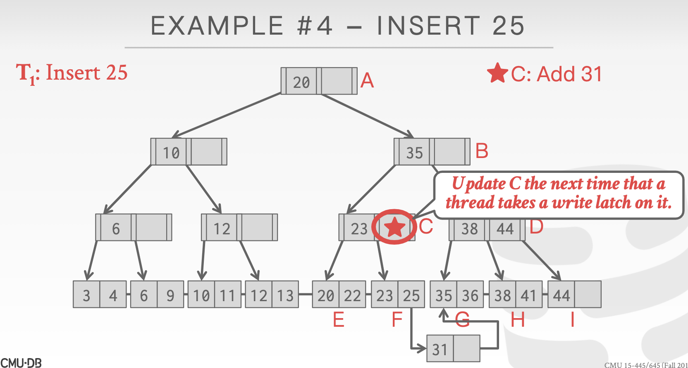

在查找 31 时，就能够根据表头信息找到正确的数据

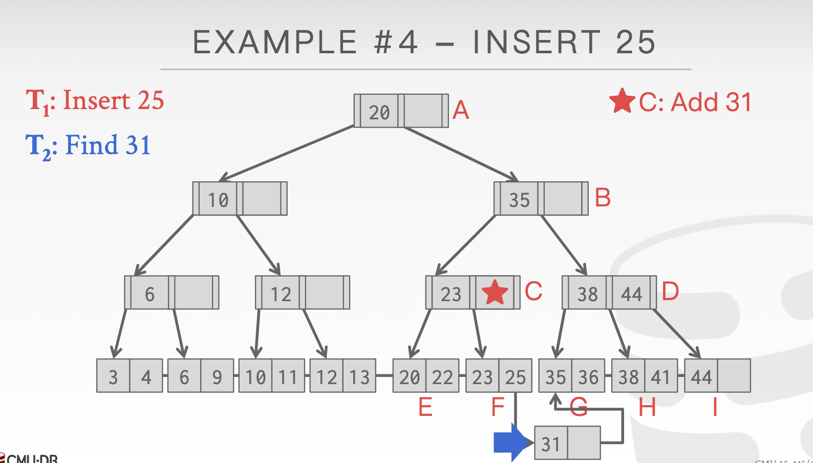

后面执行插入 33 的命令，恰好也要经过 C，并且发现表头中有保存 C 节点需要 Add 31 的操作，因此顺便获取 C 的写锁，这样就可以更新 C

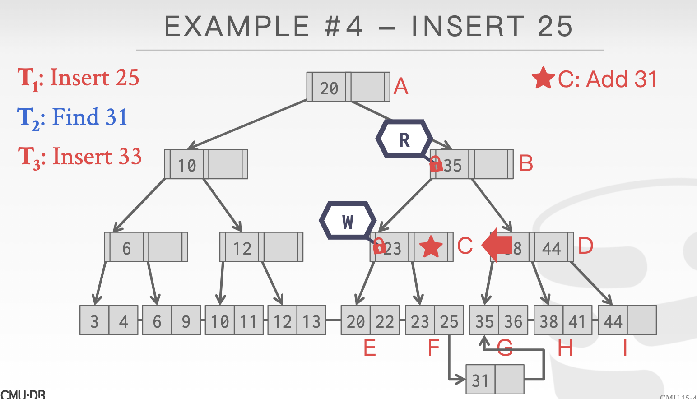

更新后，结果如下

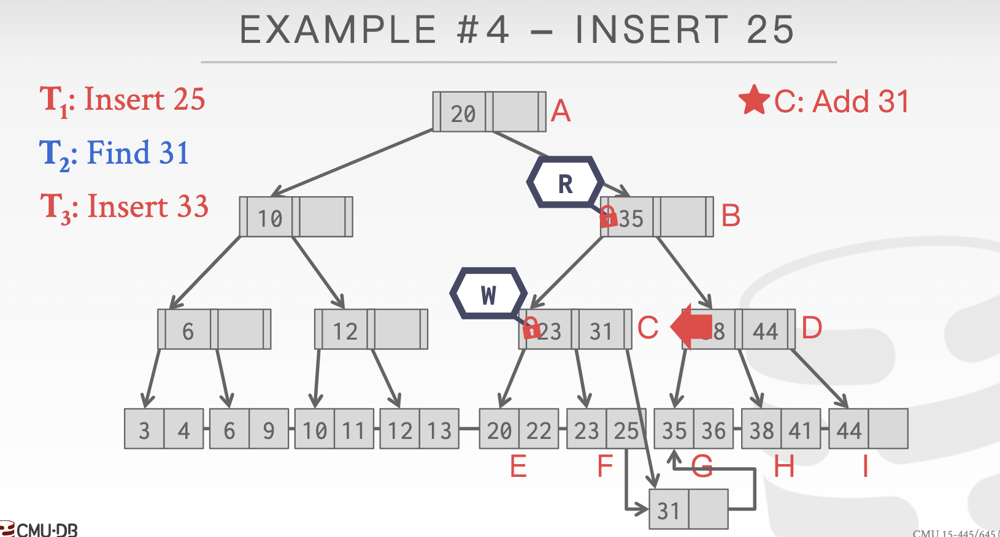

此时再将 33 插入到对应的槽中

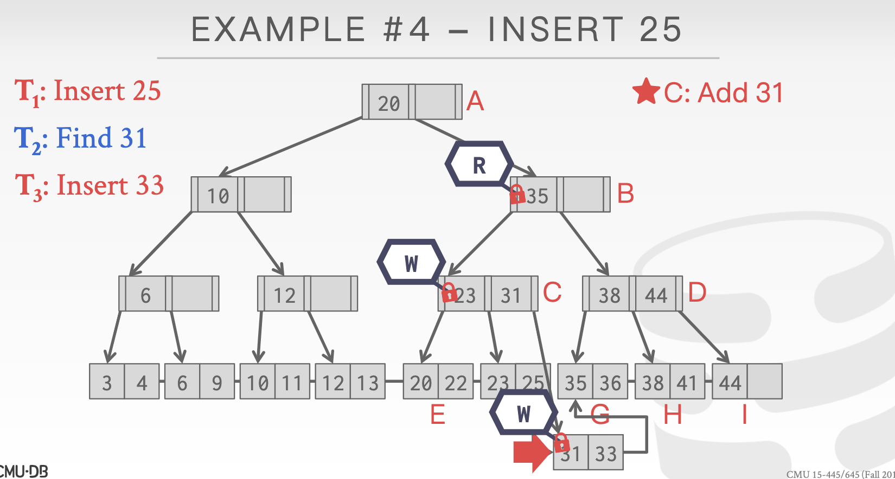
