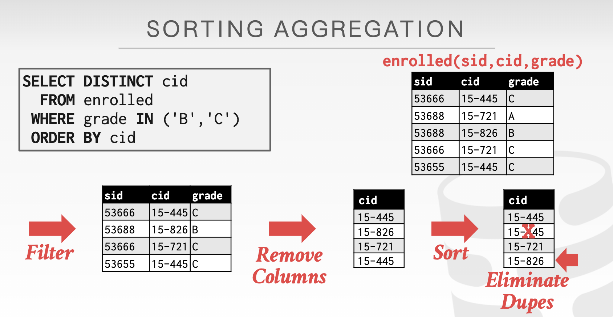

对于面向磁盘设计的DBMS来说，都是假设查询结果不能完整地存在内存中的。我们希望一些查询方案能够最大化对于磁盘的顺序读写。

## 外部归并排序

> #### 为什么需要排序算法？
>
> 尽管聚簇索引提供了一种有序查找数据的方式，但在表格中的每一行并不是有序排列的。

而一些查询语句是需要以某种顺序来获取表中的数据的

- DISTINCT，尝试获取唯一的数据，删除重复的行
- GROUP BY，聚集
- 把有序的元组装入内存，然后构建B+树索引也更快

外部归并排序包括二路归并、N路归并，归并细节不再描述。

如果一个表已经根据某个key建立了索引，则这有利于加速归并排序，因为只需要扫描树的叶子结点即可获得一个排序好的数据。**但这只对于聚簇索引有效。聚簇索引的顺序就是数据的物理存储顺序，而对非聚簇索引的索引顺序与数据物理排列顺序无关。**  

## 聚集（Aggregations）

Aggregation有两种实现方式，一种是sort，另一种是hash。

### Sorting aggregation

例如这个带DISTINCT的查询，通过排序之后，就可以消除重复的键。

对于带有ORDER BY命令的查询来说，使用sort是一件双赢的事，既满足了ORDER BY，也能够消除重复；但是对于一些不要求顺序的查询语句来说，hash可能是更好的选择。

### External Hash Aggregate

Hash因为其hash函数的随机性，可能会造成很多随机读写，导致浪费磁盘的IO。因此有两步步骤来最大化利用磁盘的每次IO。

分区：基于hash key将元组分到各个桶里面，当每个桶满的时候再将其写入磁盘

重新哈希：为每个分区构建一个内存哈希表，然后计算其aggregate

#### Phase1 Partition

使用哈希函数h1将元组划分成不同的分区，所有的相同的哈希值是存放在同一个分区中的。分区的数据是通过output buffer来写入到磁盘的。

> 到底什么是分区?分区可以理解为是hash函数映射到的n个空间，在哈希表中，这可以是n个链表，链表中的每一项可以是一个页面。在这里，n个空间也可以是一个buffer pool，当一个buffer pool满了之后，就写入到磁盘。

假设我们有B个buffer，就可以使用B-1个buffer作为分区，1个buffer作为输入的数据。

 #### Phase2 Rehash

对于每个磁盘上的分区：

- 将其读进内存，然后根据第二个hash函数h2构建一个内存中的哈希表
- 遍历这个哈希表的每个桶，将匹配的元组放进去

这要求每个桶都是能放进内存的。 

在ReHash阶段，DBMS可以存储形式为（GroupByKey→RunningValue）的对，以计算聚合。RunningValue的内容取决于聚合函数。要向哈希表插入一个新元组：

- 如果它找到一个匹配的GroupByKey，那么就适当地更新RunningValue。
- 否则，插入一个新的（GroupByKey→RunningValue）对。

