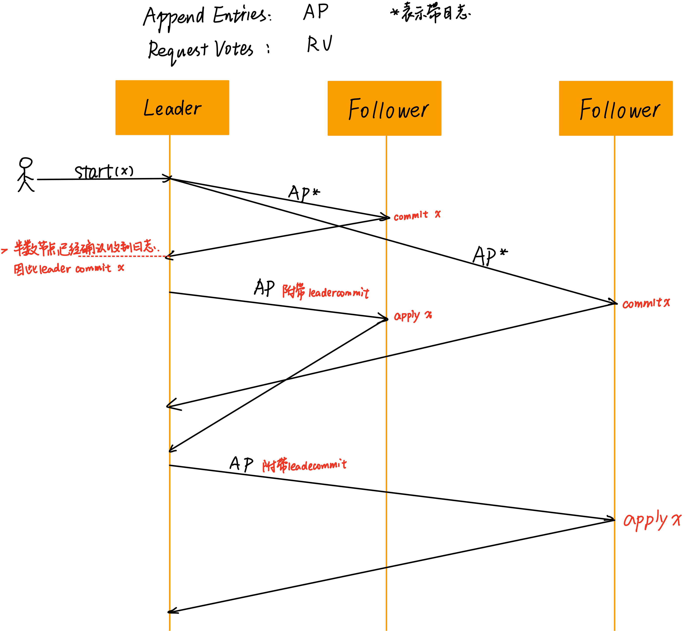
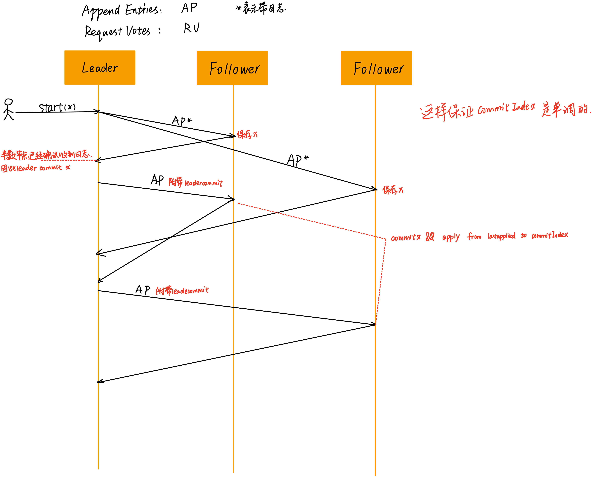
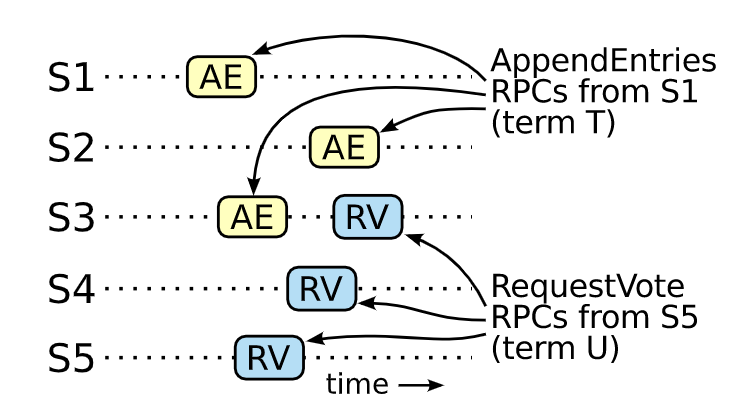

## 简介

在 raft 出现之前，paxos 在共识算法的讨论中占据了主导地位。但是 paxos 太难懂了，还难实现，因此 raft 诞生了。

相较于其他的共识算法，raft 有以下几个特点：

* **更强的 leader**。比如日志只会从 leader 流向其他的服务器，这样使得日志便于管理，并且也更容易理解
* **leader 的选举机制**。在其他共识算法已经有的心跳机制的基础上，增加一些方法即可解决难题
* **成员更替**。用了一种新方法来保证集群在配置变化（如扩缩容）时能够正常运行。

raft 将自己分成了三部分：**Leader 选举、日志复制、和安全**。关于 raft 算法的基本内容网上已有非常多的说明，不再详细赘述。下面根据做实验的过程中出现的问题以及这个总纲进行总结。


## 每个节点包含的信息

每一个 raft 节点都会包含自己的状态，考虑一个单机环境下的节点有哪些状态。

### 持久化的状态

这里将当前节点称为 A。持久化意味着会落盘。

| 名称        | 描述                                                         |
| ----------- | ------------------------------------------------------------ |
| currentTerm | 节点当前的任期                                               |
| voteFor     | 表示 A 在当前的这个 term 下，给某个节点 voteFor 投票               |
| log[]       | 日志，每条日志会包括针对一个状态机的命令，以及收到这个命令时的 term。注意，起始的 index 是 1。 |

这三个状态在每次的 RPC 返回之前会被持久化到磁盘上。

### 非持久化的状态

| 所有服务器都有的状态 | 描述                                              |
| -------------------- | ------------------------------------------------- |
| commitIndex          | 已知的最大的被 commit 的日志的 index，单调增长       |
| lastApplied          | 已知的最大的被应用到状态机的日志的 index，单调增长 |

commitIndex 针对的是存储在节点中的日志，而 lastApplied 针对的是这条日志里的命令是否被执行。这意味着如果节点已经 commit 了 index 为 i 的日志，当状态机坏掉，或者重置时，可以根据这些 log 恢复状态。

因此，不难得出，lastApplied <= commitIndex。

| leader 维护的状态，每次选举后重置 | 描述                                                         |
| ------------------------------------ | ------------------------------------------------------------ |
| nextIndex[]                          | nextIndex[i] 表示 leader 要发给 i 的下一条日志的 index             |
| matchIndex[]                         | matchIndex[i] 表示 leader 能够确保已经被复制到 i 上的日志的 index，单调增长 |

### 一些细节

思考几个问题：

1. 如果作为一个 follower，日志应该在什么时候 commit，在什么时候 apply
2. 如果作为一个 leader，日志应该在什么时候 commit，在什么时候 apply
3. 在什么时候更新 nextIndex
4. 在什么时候更新 matchIndex
5. 在什么时候更新 lastApplied

针对问题 1 和 2，看下面的两个图。

  

图 a 和图 b 展示了客户发送请求给 leader，leader 将对应的 log 复制给 follower，follower 回复 leader 的过程。在 raft 集群中，如果节点不失效的话，一个正常的过程就是 leader 发送带日志的心跳给 follower，当 leader 确定这条日志已经被复制到多数 follower 上时，就可以向客户端保证这条日志已经被 commit 了。

下面是图 b 的动态过程展示：



对于 leader 来说，其日志的 commit 一定是在日志被多数节点复制之后才进行的，而 apply 则是在 commit 之后才进行，这没有问题。但我在做实验的过程中，对于 follower 应该在什么时候 commit、apply 产生了疑惑。

* 在图 a 中，fo 收到日志后**立即 commit**，并且对 leader 回复自己的 commitIndex，leader 根据所有 fo 的回复来判断目前已知的最大的已经被复制到大多数节点上的日志的 index，将其 commit。
* 而在图 b 中，fo 在收到日志后只是**简单的存下日志**，**没有修改**自己的 commitIndex，在回复 leader 时附带的是自己已有的最大的日志 index，在第二次心跳时，才按照 leader 附带的 leaderCommit，将自己的 commitIndex 设为 `min(leaderCommit，len(rf. Logs))`。

那么哪一个更正确、容错性更高呢？是图 b 的方式。

考虑到 raft 集群内部的所有节点都是不可靠的，可能在任意时刻宕机，则图 a 的方式中，fo 在 commit x 后，回复尚未到达 leader 之前，如果 leader 宕机了，则会导致 fo 的 commitIndex 大于 leader。在后续的选举中，如果该 fo 被选举成 leader，则对外表现的行为是 x 已经被 commit。而实际上，这条日志可能尚未被复制到大多数的节点之上。图 b 则可以避免这个问题，即，任意的 commitIndex 的增加都是基于 “这条日志已经被复制到多数节点上” 这个事实。

针对问题 3 和 4

- nextIndex 在 leader 发送一条附带日志的心跳后更新比较合适，因为 leader 发送日志的时间点和 fo 接受日志的时间点可能存在着延迟，使用 nextIndex 来维护下一条将要发送给 fo 的日志的 index，可以更有效的发送日志。例如，nextIndex[i] 现在是 5，leader 发送 10 条日志给 i，则调用 rpc（尚未返回）后 nextIndex 就可以被更新为 15，以便于后续的日志复制。
- matchIndex 的更新在 leader 接收到心跳返回后更新，即 fo 在 rpc 返回附带的信息中告诉 leader 已经对应上的 Index 是多少，然后 matchIndex 将这个信息保存下来。以便于在出现日志不匹配的情况时，nextIndex 可以重置到 matchIndex。这部分在心跳 rpc 中讨论。

最后，lastApplied 在什么时候更新？一种方式是开一个协程，检测 commitIndex 的变化，如果 commitIndex 变化了，则 apply 从 lastApplied 到 commitIndex 的日志。另一种则是在 commitIndex 发生变化的时候，顺带 apply 这些部分的日志。

到此为止，[**每个节点包含的信息**](#每个节点包含的信息) 这一节的内容已经讨论完毕。

## 节点状态迁移

[**每个节点包含的信息**](#每个节点包含的信息) 讨论的是静态的，一个特定时间点的节点的状态。而本节讨论的是动态的，一个状态是如何迁移到另一个状态的，换句话说，本节讨论的是不同身份的节点应该具备的行为。

### All Servers

> - If commitIndex > lastApplied: increment lastApplied, apply log[lastApplied] to state machine (§5.3)
> - If RPC request or response contains term T > currentTerm: set currentTerm = T, convert to follower (§5.1)

第一条如上一节所说，如果 commitIndex > lastApplied，则可以将 [lastApplied+1, commitIndex] 区间内的所有日志都应用到状态机中。

第二条则是任期更新的一个保证，任意一个 rpc 的发送或者接受中如果对方的 term 比自己的更大，则自己保持 follower 的状态。

---

> 对于第二条，我存在一些**疑问**：*在集群出现分区时，也就出现了脑裂的现象，旧 leader 被分到了小分区，却不自知，依然保持着 leader 的状态。新 leader 在大分区中选举产生。在分区合并时，倘若新旧 leader 的 term 恰好一样，则会出现一个 raft 集群中存在着两个 leader 的现象。因为身份降级的逻辑是对方的 term 比自己的大，而此时双方的 term 相等，没有触发降级的逻辑*。  我的解决方法是，将 `term T > currentTerm` 条件修改为 `term T >= currentTerm` ，不知道是否正确。

更新：将 `term T > currentTerm` 条件直接修改为 `term T >= currentTerm` 过于粗暴，可能会导致两个 leader 中已经被 commit 日志丢失，情况类似于 [一些问题](#一些问题)这一节。因此，更加稳妥的方式是修改成 `term > currentTerm || args.LeaderCommit >= rf.CommitIndex`。“或”条件会短路，因此如果对方的 term 更大，则直接变成 follower，如果相等，则判断谁的 commitIndex 更大。

---

### Followers

对于 follower，应该具备的行为是：

- 回复 leader 和 candidate 向他发送的 rpc
- 如果一段时间内没有收到心跳，或者没有给 candidate 投出票，则自己升级为 candidate 发起选举。

论文中第二点的原文是 “*If election timeout elapses without receiving AppendEntries RPC from current leader or granting vote to candidate: convert to candidate*”，里面提到的超时说的是选举超时。而我在实现时考虑的是心跳超时，即，我设置了两个计时器，一个是心跳超时计时器，另一个是选举超时计时器。下面是我的实现：

- 心跳超时计时器的作用是将 follower 的状态变成 candidate。只要 leader 一直发送心跳，其他服务器就会一直重置计时器，从而不会发起选举。follower 变成 candidate 当且仅当 leader 宕机，或者出现分区。值得注意的是，“给 candidate 投出票” 后，也需要重置心跳计时器，防止出现整个选举的时间超过心跳超时的时间，从而导致有多个 server 同时在进行选举。
- 选举超时计时器的是针对 candidate 的，如果 candidate 没有变成 follower 或者 leader，则当计时器超时时，发起一轮新的选举。

该设计的问题是心跳超时计时器仅仅负责状态变化，而整个选举流程是在选举超时计时器中触发的，可能会出现一个空窗期导致意外的结果发生。后来我将它改进成了一旦发生了状态变化（follower->candidate），就触发一轮选举。

### Candidates

这一部分没有太多值得注意的地方。

- follower 切换到 candidate 身份之后，发起一轮选举：
  - 自增 currentTerm
  - 自己给自己投票
  - 重置选举超时计时器
  - 向所有的其他服务器发送选举 rpc

- 如果本次选举得到了多数节点的同意，则切换状态为 leader
- 如果在选举过程中收到了其他节点的心跳 rpc，则切换为 follower
- 如果选举超时，则重新发起一轮选举

### Leaders

- 当选后，先向其他节点发送用于初始化的空心跳 rpc，后续定期发送防止其他节点的选举超时
- 从客户端接收到指令后，先添加到本地的日志里，在 apply 到状态机后（一定是在 commit 之后）再回复客户端
- 如果主机 log 最长的 index >= follower 的 nextIndex，就向 follower 发送 [nextIndex, len(rf.Logs)) 范围内的日志
  - **如果成功发送，则更新这个 follower 的 nextIndex 和 matchIndex**
  - 如果失败，则减少 nextIndex，并且重试
- **如果多数节点的 matchIndex 都 >= N，且 N>commitIndex，且 N 尽量大，且 rf.Logs[N] 的 term 等于 currentTerm，就把 commitIndex 更新为 N**

注意，在 [一些细节](#一些细节） 这节中，我提到的是“发送 rpc 之前就更新了 nextIndex，收到返回后再更新 matchIndex”，而在这节中，论文里提到的是“收到返回后再更新两者”。**个人认为**论文中的方式里的 rpc 会占用更多的字节，比如在第一次发送带日志的心跳 rpc 后，紧接着又发了一次新的，此时第一个尚未返回，则第二个 rpc 的日志包括了第一次发送的结果。如果失败了，则直接将 nextIndex 重置为 matchIndex+1（或者按照 rpc 返回时附带的消息进行重置)即可。

## 心跳 RPC

由 leader 调用，用于复制日志，也用于心跳。

| 调用参数     | 描述                                                   |
| ------------ | ------------------------------------------------------ |
| term         | leader 当前的 term                                     |
| leaderId     | 告诉 follower 本次是谁调用它的                         |
| prevLogIndex | 新日志之前的 log 的 index                              |
| prevLogTerm  | 这条日志的 term                                        |
| entries[]    | 新日志                                                 |
| leaderCommit | leader 的 commitIndex，用于 commit 和 apply 自己的日志 |

| 返回参数 | 描述                                                         |
| -------- | ------------------------------------------------------------ |
| term     | follower 的 term，让 leader 可以更新自己的 term              |
| success  | follower 是否匹配上 prevLogIndex 和 prevLogTerm              |
| index    | 记录 follower 已有的日志的 index，便于让 leader 知道日志是否被复制到了多数节点 |

函数大概逻辑：

- 如果 leader 的 term 比自己的小，返回 false
- 如果是心跳，并且没有匹配上日志（prevLogIndex 和 prevLogTerm），返回 false
- 如果匹配上了，但是后续的日志有冲突，则删除这条及其之后的所有日志
- 将新日志追加到末尾
- 如果 leaderCommit>commitIndex，则设置 commitIndex=min(leaderCommit, len(rf.Logs)-1)，此时顺带 apply 一下这些日志。

注意的点：

- log entriy 中的 term 的作用是检测日志的不一致。
- leader 决定什么时候 apply 一条 entry 是安全的，这样一个安全的 entry 被称作 committed。
- 一条日志是 committed，当且仅当这条 entry 已经被复制到了多数节点中。
- 一条日志被 commit，则这条日志之前的所有日志都被顺带 commit（论文中只提到了 leader）

**Log Matching Property**

- 如果两个 entries 在不同 server 的 log 中有相同的 index 和 term，则里面存储着相同的 command
- 如果两个 entries 在不同 server 的 log 中有相同的 index 和 term，这条日志及其之前的日志是完全一致的。

## 选举 RPC

| 调用参数     | 描述                                           |
| ------------ | ---------------------------------------------- |
| term         | candidate 当前的 term                          |
| candidateId  | 告诉 follower 本次是谁调用它的                 |
| lastLogIndex | 选举者的最后一条日志的 index（用于比较谁更新） |
| lastLogTerm  | 这条日志的 term                                |

| 返回参数 | 描述                                               |
| -------- | -------------------------------------------------- |
| term     | follower 的 term，让 candidate 可以更新自己的 term |
| success  | follower 是否投票                                  |

实现逻辑：

- 如果 candidate 的 term 比自己的小，返回 false
- 如果这个 term 没有投过票，并且 candidate 的日志与 follower 匹配，或者更新，则投票，否则不投票

注意的点：

- 每个 server 在同一个 term 里最多只能投票给一个人
- candidate 在选举的过程中如果收到心跳，并且这个心跳的 term 大于等于自己的 term 则转变为 follower。如果小于，则保持 candidate 的状态，继续选举。
- 可能会瓜分选票。通过随机化选举超时时间解决。

## 安全性证明

### Election Safety

>  在一个给定的 term 里最多只有一个 leader。

一个 term 里收到半数以上选票的才能成为 leader，因此在同一任期内只会有一个 leader。

提问：集群出现分区，leader A 被分到了小分区，大分区选举出了 leader B。在两个分区合并时，要怎么处理才能使得只有一个 leader？

### Leader Append-Only

> leader 不会删除或者覆盖自己的日志，只会追加日志。

### Log Matching Property

> 如果两条日志在相同的 index 的日志条目的 term 相同，那么我们就认为这个日志从头到这个 index 之间全部完全相同。

上述表达可以被拆解为两点：

- 如果两个 entries 在不同 server 的 log 中有相同的 index 和 term，则里面存储着相同的 command

因为 leader 只会在给定的一个 index 和 term 写入至多一条日志，并且这条日志的位置不会改变。

- 如果两个 entries 在不同 server 的 log 中有相同的 index 和 term，这条日志及其之前的日志是完全一致的。

这一条通过心跳来保证。leader 在发送心跳时会带上一个 prevLogIndex 和 prevLogTerm，如果 follower 在这个 prevLogIndex 位置上找不到这样一个带有 prevLogTerm 的日志，则会拒绝这个心跳。——称为 **consistency check**

使用归纳法证明：

1. 在初始状态时，日志是满足 Log Matching Property 的。
2. consistency check 保证了 leader 知道追加 follower 之前的日志是与自己一致的，再加上自己追加的日志也是与自己一致的，因此每次成功追加日志的操作一定能保证一致性。

但是，leader 的崩溃宕机会导致日志的不一致（比如旧 leader 尚未将几条日志复制到多数节点上，就崩溃了；新 leader 上线后，经历了同样的事情又崩溃了）。raft 通过让 follower 强制同步 leader 的日志来处理这个问题。

使用的方法为：

1. leader 找到最新的，自己与 follower 一致的日志的 index
2. 删除所有的这个 index 之后的日志
3. leader 将这个 index 之后的所有的日志发送给 follower

上述操作在 **consistency check** 之后进行。

怎么找到这个一致的 index 呢？raft 论文中提到的方法是利用维护的 nextIndex，如果 follower 拒绝了那条心跳 rpc，nextIndex 就减一，然后重试，直到出现一致的情况。然后，心跳 rpc 会把这条日志之后的所有的日志删除，并且将新日志追加，因此保证了日志的一致。

很显然，递减的操作性能不够良好。**一个优化的方法**是 follower 可以返回包含这个  term 的最小的 index，因此 leader 可以以 term 来进行跳跃，而不是通过 index，速度更快。

**有了上述方法后，leader 就不需要特意去维护一致性了，全都可以通过心跳来顺带实现。**

### Leader Completeness

> 一条日志在一个 term 里被 commit，则这条日志一定会被有更大的 term 的 leader 看到。

1. 日志只会从 leader 流向 follower，并且 leader 永远不会覆盖或者删除自己的日志。
2. 选举机制保证只有包含了所有的已经 commit 的日志才能赢得选举。
3. 选举人必须赢得半数以上节点的投票，这意味着 committed 日志至少在这些节点中的一个里出现。（commit 需要半数以上的人复制这条日志）
4. 如果选举人的日志至少和其他的节点的日志一样新（或者更新），这说明他会拥有所有的 commit 的日志

RequestVote 添加了上述方法，保证了 leader 日志的 completeness。

### State Machine Safety

> 在同一个 index 位置，不会有不同的 server 去 apply 不同的日志。即在同一位置，所有 server apply 的日志都是相同的。

1. 因为想要 commit 一条日志，必须将其复制到半数以上的节点
2. 又因为想要赢得一次选举，必须获得半数以上节点的投票

因此，这两次动作中，至少会有一个服务器是**既参与了选举，也参与了心跳**的。



如果 S5 进行选举，则收到心跳的服务器不会进行投票，就能够保证了 S5 不会赢得选举。根据上面的 [**Leader Completeness**](#leader-completeness) ，就可以知道当一个服务器在其状态机上 apply 一个日志时，它的日志必须与领导者的日志一致，并且该日志必须被 commit。现在考虑任何服务器应用一个给定的日志索引的最低术语；Log Completeness Property 保证所有更高 term 的 leader 将存储相同的日志，因此在以后的 term 中 apply 该 index 的服务器将 apply 相同的值。

## 一些问题

### 边界情况一

目标：如果一个 log entry 已经在大多数节点上了，则这个日志被认为是 committed。如果 leader 恰好在 commit 这条日志之前宕机了，那么按道理来说，后续的 leader 应该去完成前人未竟之业——commit 这条日志。

但事实是后来的 leader 不能马上判断出不是自己这个 term 的且已经被复制到多数节点的日志是否被 commit。下面的视频是论文中 figure 8 的动态展示：



那么如何避免上述问题呢？论文对 leader 进行了一些限制：不允许通过计算日志副本的数量去 **commit 以前的日志**。换句话说，只能通过 “计算日志副本的数量” 的方法 commit **当前 term 的日志**。一旦 commit 了当前 term 的一条日志，那么根据 [**log matching property**](#log-matching-property) 就可以间接地 commit 之前的 term 里的日志。

### 边界情况二

在实现了上述的功能后，仍然不能满足测试用例的需求。举一个简单的例子：

> 集群有 a，b，c 三个节点，初始任期都是 0。在选举过程中，a 成功当选，当选后，三者的任期都是 1。a 当选后收到了一条客户端的信息，就立即发送了一轮带日志的心跳。心跳到达了 b，b 承认了 a 这个 leader。但心跳在到达 c 之前，c 的心跳超时了，自增任期，发起了一轮选举。此时三者的任期变成了 1，1，2。然后心跳到达了 c，c 发现 leader 的心跳任期比自己小，因此不理会这条心跳。在后续的选举中，a 拒绝投票，因为日志不匹配，但是 c 还是当选成功（赢得了 b 和 c 的选票）。因此客户端的消息丢失。

在实际工程中，这样的情况其实可以忽略。因为为了保证服务的可用，一定会有重试的机制，即如果发现这条命令没有被 commit，则会重试。但这并不意味着我这样的实现没有问题。

如果按照论文中的“每个 leader 当选之后，先发送一个**空心跳**，后续再发带日志的心跳”做，那么可以解决这个问题。但随之而来的是另一个问题：小分区的 leader 有很多多余的日志，但这些没有被 commit。而大分区里有一些新的日志，并且已经被 commit。因此分区合并之后，新 leader 依旧是大分区的，其发送空心跳后，小分区的 leader 就把 leaderCommit 及其之前的日志 apply 了。但实际上，leaderCommit 及其之前的日志与大分区的日志是不相同的。那么怎么判断 leaderCommit 及其之前的日志是一致的呢？

我的做法是在发送心跳之前，**检查接收方的 matchIndex 是否小于 leader 的 commitIndex**。因为 leader 的 commitIndex 一定是基于多数节点都已经保存这个数据的事实。如果 matchIndex[i] < leaderCommit，则说明 i 是少数节点，我们不能保证少数节点里没有脏数据，因此直接将 rpc 调用里的 leaderCommit 设置为 matchIndex[i]，重新走一遍流程。（matchIndex[i] 能够保证这个 index 及其之前的 index 的日志一定是一致的）。

另外，空心跳的实现方法如下：`beat(empty bool)` 。

```go
func (rf *Raft) sendHearBeatsClock(ctx context.Context) {
	for {
		select {
		case <-rf.beatCh:
			rf.beat(false)
		case <-rf.HeartBeatTicker.C:
			rf.beat(true)
		case <-ctx.Done():
			return
		}
	}
}
```
